<!-- README.md is generated from README.Rmd. Please edit that file -->

# shorts 

<!-- badges: start -->

[](https://cran.r-project.org/package=shorts)
[](https://zenodo.org/badge/latestdoi/254907272)
<!-- badges: end -->

This package creates short sprint (&lt;6sec) profiles using the split
times, or the radar gun data. Mono-exponential equation is used to
estimate maximal sprinting speed (MSS), relative acceleration (TAU), and
other parameters. These parameters can be used to predict kinematic and
kinetics variables and to compare individuals.

## Installation

``` r
# Install from CRAN
install.packages("shorts")

# Or the development version from GitHub
# install.packages("devtools")
devtools::install_github("mladenjovanovic/shorts")
```

## Examples

`shorts` comes with two sample data sets: `split_times` and
`radar_gun_data` with N=5 athletes. Let’s load them both:

``` r
require(shorts)
require(tidyverse)
require(knitr)

data("split_times", "radar_gun_data")
```

### Profiling using split times

To model sprint performance using split times, distance will be used as
predictor and time as target. Since `split_times` contains data for
multiple athletes, let’s extract only one athlete and model it using
`shorts::model_using_splits()` function.

``` r
kimberley_data <- filter(split_times, athlete == "Kimberley")

kable(kimberley_data)
```

| athlete   | bodyweight | distance |  time |
|:----------|-----------:|---------:|------:|
| Kimberley |         55 |        5 | 1.158 |
| Kimberley |         55 |       10 | 1.893 |
| Kimberley |         55 |       15 | 2.541 |
| Kimberley |         55 |       20 | 3.149 |
| Kimberley |         55 |       30 | 4.313 |
| Kimberley |         55 |       40 | 5.444 |

`shorts::model_using_splits()` returns an object with `parameters`,
`model_fit`, `model` returned from `stats::nls()` function and `data`
used to estimate parameters. Parameters estimated using mono-exponential
equation are *maximal sprinting speed* (MSS), and *relative
acceleration* (TAU). Additional parameters computed from MSS and TAU are
*maximal acceleration* (MAC) and *maximal relative power* (PMAX) (which
is calculated as MAC\*MSS/4).

``` r
kimberley_profile <- shorts::model_using_splits(
  distance = kimberley_data$distance,
  time = kimberley_data$time)  

kimberley_profile
#> Estimated model parameters
#> --------------------------
#>                 MSS                 TAU                 MAC                PMAX 
#>               8.591               0.811              10.589              22.743 
#>     time_correction distance_correction 
#>               0.000               0.000 
#> 
#> Model fit estimators
#> --------------------
#>       RSE R_squared    minErr    maxErr maxAbsErr      RMSE       MAE      MAPE 
#>    0.0340    0.9997   -0.0270    0.0529    0.0529    0.0278    0.0233    1.1926

summary(kimberley_profile)
#> 
#> Formula: corrected_time ~ TAU * I(LambertW::W(-exp(1)^(-distance/(MSS * 
#>     TAU) - 1))) + distance/MSS + TAU
#> 
#> Parameters:
#>     Estimate Std. Error t value Pr(>|t|)    
#> MSS   8.5911     0.1225    70.1  2.5e-07 ***
#> TAU   0.8113     0.0458    17.7  6.0e-05 ***
#> ---
#> Signif. codes:  0 '***' 0.001 '**' 0.01 '*' 0.05 '.' 0.1 ' ' 1
#> 
#> Residual standard error: 0.034 on 4 degrees of freedom
#> 
#> Number of iterations to convergence: 4 
#> Achieved convergence tolerance: 4.06e-06

coef(kimberley_profile)
#>                 MSS                 TAU                 MAC                PMAX 
#>               8.591               0.811              10.589              22.743 
#>     time_correction distance_correction 
#>               0.000               0.000
```

To return the predicted outcome (in this case time variable), use
`predict()` function:

``` r
predict(kimberley_profile)
#> [1] 1.21 1.90 2.52 3.12 4.30 5.47
```

To create a simple plot, use S3 `plot()` method:

``` r
plot(kimberley_profile) +
  theme_bw()
```

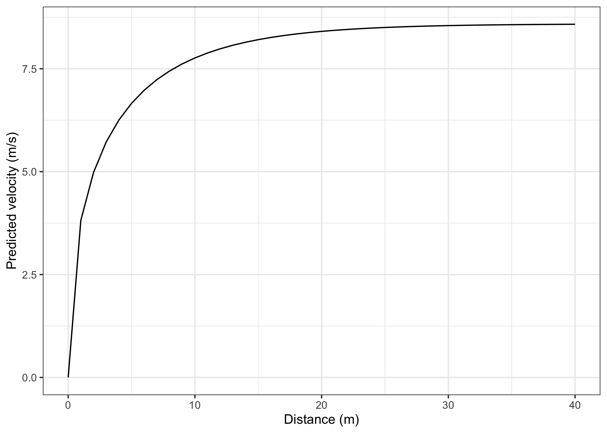

If you are interested in calculating average split velocity, use
`shorts::format_splits()`

``` r
kable(shorts::format_splits(
  distance = kimberley_data$distance,
  time = kimberley_data$time))
```

| split | split\_distance\_start | split\_distance\_stop | split\_distance | split\_time\_start | split\_time\_stop | split\_time | split\_mean\_velocity |
|------:|-----------------------:|----------------------:|----------------:|-------------------:|------------------:|------------:|----------------------:|
|     1 |                      0 |                     5 |               5 |                  0 |             1.158 |       1.158 |            4.317789…. |
|     2 |                      5 |                    10 |               5 |              1.158 |             1.893 |       0.735 |            6.802721…. |
|     3 |                     10 |                    15 |               5 |              1.893 |             2.541 |       0.648 |            7.716049…. |
|     4 |                     15 |                    20 |               5 |              2.541 |             3.149 |       0.608 |            8.223684…. |
|     5 |                     20 |                    30 |              10 |              3.149 |             4.313 |       1.164 |            8.591065…. |
|     6 |                     30 |                    40 |              10 |              4.313 |             5.444 |       1.131 |            8.841732…. |

Let’s plot observed vs fitted split times. For this we can use `data`
returned from `shorts::model_using_splits()` since it contains
`pred_time` column.

``` r
ggplot(kimberley_profile$data, aes(x = distance)) +
  theme_bw() +
  geom_point(aes(y = time)) +
  geom_line(aes(y = pred_time)) +
  xlab("Distance (m)") +
  ylab("Time (s)")
```

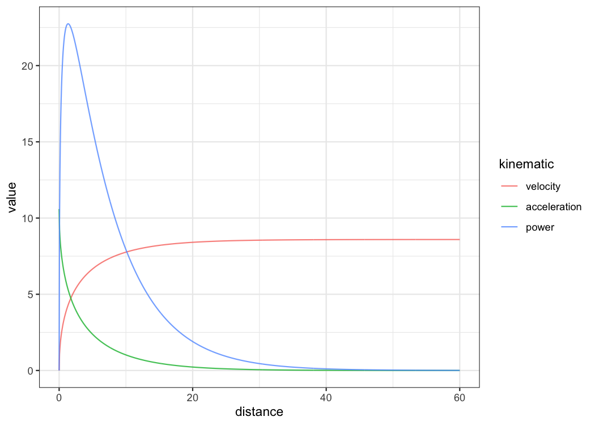

To plot predicted velocity, acceleration, air resistance, force, and
power over distance, use `shorts:predict_XXX()`. Please note that to
calculate force, air resistance, and power, we need Kimberley’s bodymass
and height (as well as other characteristics such as air pressure,
temperature and wind - see `get_air_resistance()` function).

``` r
kimberley_bodymass <- 60 # in kilograms
kimberley_bodyheight <- 1.7 # in meters

kimberley_pred <- tibble(
  distance = seq(0, 40, length.out = 1000),
  
  # Velocity
  pred_velocity = shorts::predict_velocity_at_distance(
    distance,
    kimberley_profile$parameters$MSS,
    kimberley_profile$parameters$TAU),
  
  # Acceleration
  pred_acceleration = shorts::predict_acceleration_at_distance(
    distance,
    kimberley_profile$parameters$MSS,
    kimberley_profile$parameters$TAU),
  
  # Air resistance
  pred_air_resistance = shorts::predict_air_resistance_at_distance(
    distance,
    kimberley_profile$parameters$MSS,
    kimberley_profile$parameters$TAU,
    bodymass = kimberley_bodymass,
    bodyheight = kimberley_bodyheight),
  
  # Force
  pred_force = shorts::predict_force_at_distance(
    distance,
    kimberley_profile$parameters$MSS,
    kimberley_profile$parameters$TAU,
    bodymass = kimberley_bodymass,
    bodyheight = kimberley_bodyheight),
  
  # Power
  pred_power = shorts::predict_power_at_distance(
    distance,
    kimberley_profile$parameters$MSS,
    kimberley_profile$parameters$TAU,
    bodymass = kimberley_bodymass,
    bodyheight = kimberley_bodyheight),
)

# Convert to long
kimberley_pred <- gather(kimberley_pred, "metric", "value", -distance)

ggplot(kimberley_pred, aes(x = distance, y = value)) +
  theme_bw() +
  geom_line() +
  facet_wrap(~metric, scales = "free_y") + 
  xlab("Distance (m)") +
  ylab(NULL)
```

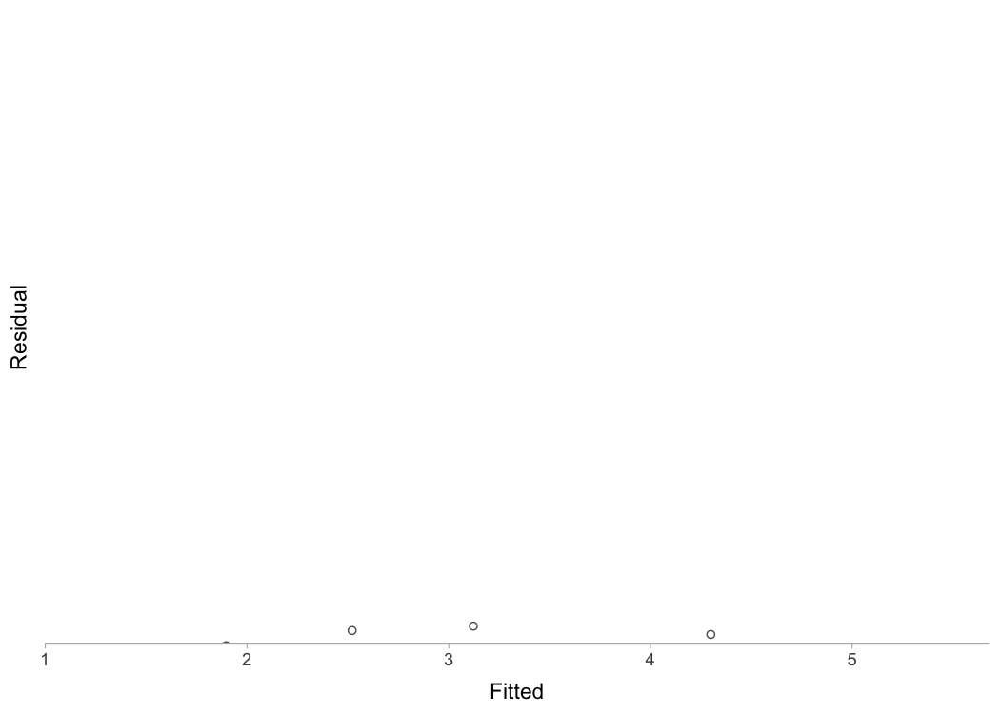

To do prediction simpler, use `shorts::predict_kinematics()` function.
This will provide kinetics and kinematics for 0-6s sprint using 100Hz.

``` r
predicted_kinematics <- predict_kinematics(
  kimberley_profile,
  bodymass = kimberley_bodymass,
  bodyheight = kimberley_bodyheight)

kable(head(predicted_kinematics))
```

| time | distance | velocity | acceleration | bodymass | net\_horizontal\_force | air\_resistance | horizontal\_force | horizontal\_force\_relative | vertical\_force | resultant\_force | resultant\_force\_relative | power | relative\_power |    RF | force\_angle |
|-----:|---------:|---------:|-------------:|---------:|-----------------------:|----------------:|------------------:|----------------------------:|----------------:|-----------------:|---------------------------:|------:|----------------:|------:|-------------:|
| 0.00 |    0.000 |    0.000 |        10.59 |       60 |                    635 |           0.000 |               635 |                       10.59 |             589 |              866 |                       14.4 |     0 |            0.00 | 0.734 |         42.8 |
| 0.01 |    0.001 |    0.105 |        10.46 |       60 |                    628 |           0.003 |               628 |                       10.46 |             589 |              860 |                       14.3 |    66 |            1.10 | 0.729 |         43.2 |
| 0.02 |    0.002 |    0.209 |        10.33 |       60 |                    620 |           0.011 |               620 |                       10.33 |             589 |              855 |                       14.2 |   130 |            2.16 | 0.725 |         43.5 |
| 0.03 |    0.005 |    0.312 |        10.21 |       60 |                    612 |           0.023 |               612 |                       10.21 |             589 |              849 |                       14.2 |   191 |            3.18 | 0.721 |         43.9 |
| 0.04 |    0.008 |    0.413 |        10.08 |       60 |                    605 |           0.041 |               605 |                       10.08 |             589 |              844 |                       14.1 |   250 |            4.17 | 0.717 |         44.2 |
| 0.05 |    0.013 |    0.513 |         9.96 |       60 |                    597 |           0.063 |               597 |                        9.96 |             589 |              839 |                       14.0 |   307 |            5.11 | 0.712 |         44.6 |

To get model residuals, use `residuals()` function:

``` r
residuals(kimberley_profile)
#> [1]  0.05293  0.00402 -0.01997 -0.02699 -0.01376  0.02232
```

Package `shorts` comes with `find_XXX()` family of functions that allow
finding peak power and it’s location, as well as *critical distance*
over which velocity, acceleration, or power drops below certain
threshold:

``` r
# Peak power and location
shorts::find_max_power_distance(
  kimberley_profile$parameters$MSS,
  kimberley_profile$parameters$TAU
)
#> $max_power
#> [1] 1728
#> 
#> $distance
#> [1] 1.42

# Distance over which power is over 50%
shorts::find_power_critical_distance(
  MSS = kimberley_profile$parameters$MSS,
  TAU = kimberley_profile$parameters$TAU,
  percent = 0.5
)
#> $lower
#> [1] 0.0856
#> 
#> $upper
#> [1] 8.36

# Distance over which acceleration is under 50%
shorts::find_acceleration_critical_distance(
  MSS = kimberley_profile$parameters$MSS,
  TAU = kimberley_profile$parameters$TAU,
  percent = 0.5
)
#> [1] 1.35

# Distance over which velocity is over 95%
shorts::find_velocity_critical_distance(
  MSS = kimberley_profile$parameters$MSS,
  TAU = kimberley_profile$parameters$TAU,
  percent = 0.95
)
#> [1] 14.3
```

#### Mixed-effect models

Each individual can be modeled separately, or we can perform *non-linear
mixed model* using `nlme()` function from *nlme* package (Pinheiro *et
al.*, 2019). This is done using `shorts::mixed_model_using_splits()`:

``` r
mixed_model <- shorts::mixed_model_using_splits(
  data = split_times,
  distance = "distance",
  time = "time",
  athlete = "athlete"
)

mixed_model
#> Estimated fixed model parameters
#> --------------------------------
#>                 MSS                 TAU                 MAC                PMAX 
#>               8.065               0.655              12.309              24.818 
#>     time_correction distance_correction 
#>               0.000               0.000 
#> 
#> Estimated random model parameters
#> ----------------------------------
#>     athlete  MSS   TAU  MAC PMAX time_correction distance_correction
#> 1     James 9.69 0.847 11.4 27.7               0                   0
#> 2       Jim 7.83 0.505 15.5 30.4               0                   0
#> 3      John 7.78 0.727 10.7 20.8               0                   0
#> 4 Kimberley 8.57 0.802 10.7 22.9               0                   0
#> 5  Samantha 6.45 0.395 16.3 26.4               0                   0
#> 
#> Model fit estimators
#> --------------------
#>       RSE R_squared    minErr    maxErr maxAbsErr      RMSE       MAE      MAPE 
#>    0.0260    0.9998   -0.0293    0.0496    0.0496    0.0214    0.0172    0.9019

summary(mixed_model)
#> Nonlinear mixed-effects model fit by maximum likelihood
#>   Model: corrected_time ~ TAU * I(LambertW::W(-exp(1)^(-distance/(MSS *      TAU) - 1))) + distance/MSS + TAU 
#>   Data: train 
#>     AIC   BIC logLik
#>   -75.1 -66.7   43.5
#> 
#> Random effects:
#>  Formula: list(MSS ~ 1, TAU ~ 1)
#>  Level: athlete
#>  Structure: General positive-definite, Log-Cholesky parametrization
#>          StdDev Corr 
#> MSS      1.066  MSS  
#> TAU      0.178  0.877
#> Residual 0.026       
#> 
#> Fixed effects:  MSS + TAU ~ 1 
#>     Value Std.Error DF t-value p-value
#> MSS  8.06     0.495 24   16.30       0
#> TAU  0.66     0.084 24    7.82       0
#>  Correlation: 
#>     MSS  
#> TAU 0.874
#> 
#> Standardized Within-Group Residuals:
#>    Min     Q1    Med     Q3    Max 
#> -1.909 -0.605  0.154  0.523  1.129 
#> 
#> Number of Observations: 30
#> Number of Groups: 5

coef(mixed_model)
#> $fixed
#>                 MSS                 TAU                 MAC                PMAX 
#>               8.065               0.655              12.309              24.818 
#>     time_correction distance_correction 
#>               0.000               0.000 
#> 
#> $random
#>     athlete  MSS   TAU  MAC PMAX time_correction distance_correction
#> 1     James 9.69 0.847 11.4 27.7               0                   0
#> 2       Jim 7.83 0.505 15.5 30.4               0                   0
#> 3      John 7.78 0.727 10.7 20.8               0                   0
#> 4 Kimberley 8.57 0.802 10.7 22.9               0                   0
#> 5  Samantha 6.45 0.395 16.3 26.4               0                   0

plot(mixed_model) +
  theme_bw()
```

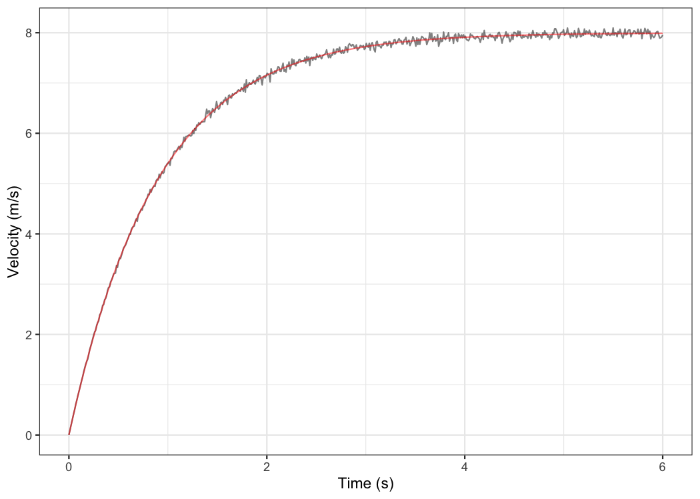

``` r
kable(mixed_model$parameters$random)
```

| athlete   |  MSS |   TAU |  MAC | PMAX | time\_correction | distance\_correction |
|:----------|-----:|------:|-----:|-----:|-----------------:|---------------------:|
| James     | 9.69 | 0.847 | 11.4 | 27.7 |                0 |                    0 |
| Jim       | 7.83 | 0.505 | 15.5 | 30.4 |                0 |                    0 |
| John      | 7.78 | 0.727 | 10.7 | 20.8 |                0 |                    0 |
| Kimberley | 8.57 | 0.802 | 10.7 | 22.9 |                0 |                    0 |
| Samantha  | 6.45 | 0.395 | 16.3 | 26.4 |                0 |                    0 |

`shorts::mixed_model_using_splits()` return the similar object, but
`parameters` contain two elements: `fixed` and `random`.

Let’s plot predicted velocity over distance for athletes in the
`split_times` data set:

``` r
velocity_over_distance <- merge(
    mixed_model$parameters$random,
    data.frame(distance = seq(0, 40, length.out = 1000))
)

velocity_over_distance$pred_velocity <- with(velocity_over_distance,
  shorts::predict_velocity_at_distance(
    distance = distance,
    MSS = MSS,
    TAU = TAU)
)

ggplot(velocity_over_distance, aes(x = distance, y = pred_velocity, color = athlete)) +
  theme_bw() +
  geom_line() +
  xlab("Distance (m)") +
  ylab("Predicted velocity (m/s)")
```


To modify random effects, which are by default `MSS` and `TAU`
(`MSS + TAU ~ 1`), use the `random` parameter. For example, we can
assume same `TAU` for all athletes and only use `MSS` as random effect:

``` r
mixed_model <- shorts::mixed_model_using_splits(
  data = split_times,
  distance = "distance",
  time = "time",
  athlete = "athlete",
  random = MSS ~ 1
)

mixed_model
#> Estimated fixed model parameters
#> --------------------------------
#>                 MSS                 TAU                 MAC                PMAX 
#>               7.937               0.628              12.644              25.087 
#>     time_correction distance_correction 
#>               0.000               0.000 
#> 
#> Estimated random model parameters
#> ----------------------------------
#>     athlete  MSS   TAU  MAC PMAX time_correction distance_correction
#> 1     James 9.02 0.628 14.4 32.4               0                   0
#> 2       Jim 8.11 0.628 12.9 26.2               0                   0
#> 3      John 7.58 0.628 12.1 22.9               0                   0
#> 4 Kimberley 8.14 0.628 13.0 26.4               0                   0
#> 5  Samantha 6.83 0.628 10.9 18.6               0                   0
#> 
#> Model fit estimators
#> --------------------
#>       RSE R_squared    minErr    maxErr maxAbsErr      RMSE       MAE      MAPE 
#>    0.0764    0.9980   -0.1023    0.1599    0.1599    0.0698    0.0585    2.6856
```

### Profiling using radar gun data

The radar gun data is modeled using measured velocity as target variable
and time as predictor. Individual analysis is performed using
`shorts::model_using_radar()` function. Let’s do analysis for Jim:

``` r
jim_data <- filter(radar_gun_data, athlete == "Jim")

jim_profile <- shorts::model_using_radar(
  time = jim_data$time,
  velocity = jim_data$velocity
)

jim_profile
#> Estimated model parameters
#> --------------------------
#>                 MSS                 TAU                 MAC                PMAX 
#>               7.998               0.889               9.000              17.995 
#>     time_correction distance_correction 
#>               0.000               0.000 
#> 
#> Model fit estimators
#> --------------------
#>       RSE R_squared    minErr    maxErr maxAbsErr      RMSE       MAE      MAPE 
#>    0.0506    0.9992   -0.1510    0.1642    0.1642    0.0505    0.0393       NaN

summary(jim_profile)
#> 
#> Formula: velocity ~ MSS * (1 - exp(1)^(-(corrected_time)/TAU))
#> 
#> Parameters:
#>     Estimate Std. Error t value Pr(>|t|)    
#> MSS  7.99793    0.00307    2606   <2e-16 ***
#> TAU  0.88866    0.00156     568   <2e-16 ***
#> ---
#> Signif. codes:  0 '***' 0.001 '**' 0.01 '*' 0.05 '.' 0.1 ' ' 1
#> 
#> Residual standard error: 0.0506 on 598 degrees of freedom
#> 
#> Number of iterations to convergence: 3 
#> Achieved convergence tolerance: 9.31e-07

plot(jim_profile) +
  theme_bw()
```

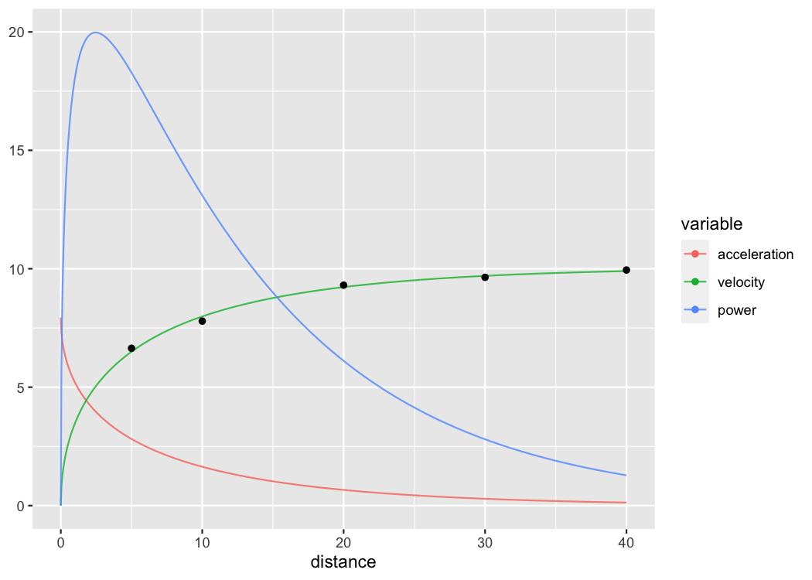

The object returned from `shorts::model_using_radar()` is same as object
returned from `shorts::model_using_splits()`. Let’s plot Jim’s measured
velocity and predicted velocity:

``` r
ggplot(jim_profile$data, aes(x = time)) +
  theme_bw() +
  geom_line(aes(y = velocity), alpha = 0.5) +
  geom_line(aes(y = pred_velocity), color = "red", alpha = 0.5) +
  xlab("Time (s)") +
  ylab("Velocity (m/s)")
```

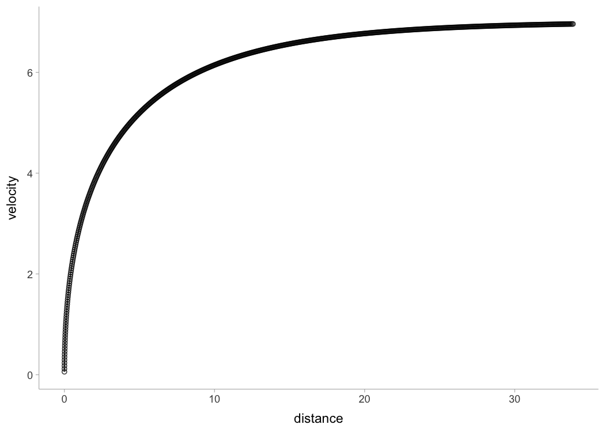

Radar gun data can be modeled individually or using *non-linear mixed
model* implemented in `shorts::mixed_model_using_radar()`:

``` r
mixed_model <- shorts::mixed_model_using_radar(
  data = radar_gun_data,
  time = "time",
  velocity = "velocity",
  athlete = "athlete"
)

mixed_model
#> Estimated fixed model parameters
#> --------------------------------
#>                 MSS                 TAU                 MAC                PMAX 
#>                8.30                1.01                8.24               17.09 
#>     time_correction distance_correction 
#>                0.00                0.00 
#> 
#> Estimated random model parameters
#> ----------------------------------
#>     athlete   MSS   TAU  MAC PMAX time_correction distance_correction
#> 1     James 10.00 1.111 9.00 22.5               0                   0
#> 2       Jim  8.00 0.889 9.00 18.0               0                   0
#> 3      John  8.00 1.069 7.48 15.0               0                   0
#> 4 Kimberley  9.01 1.286 7.01 15.8               0                   0
#> 5  Samantha  6.50 0.685 9.50 15.4               0                   0
#> 
#> Model fit estimators
#> --------------------
#>       RSE R_squared    minErr    maxErr maxAbsErr      RMSE       MAE      MAPE 
#>    0.0516    0.9994   -0.2191    0.1983    0.2191    0.0516    0.0395       NaN

summary(mixed_model)
#> Nonlinear mixed-effects model fit by maximum likelihood
#>   Model: velocity ~ MSS * (1 - exp(1)^(-(corrected_time)/TAU)) 
#>   Data: train 
#>     AIC   BIC logLik
#>   -9150 -9114   4581
#> 
#> Random effects:
#>  Formula: list(MSS ~ 1, TAU ~ 1)
#>  Level: athlete
#>  Structure: General positive-definite, Log-Cholesky parametrization
#>          StdDev Corr 
#> MSS      1.1654 MSS  
#> TAU      0.2050 0.811
#> Residual 0.0516      
#> 
#> Fixed effects:  MSS + TAU ~ 1 
#>     Value Std.Error   DF t-value p-value
#> MSS  8.30     0.521 2994    15.9       0
#> TAU  1.01     0.092 2994    11.0       0
#>  Correlation: 
#>     MSS  
#> TAU 0.811
#> 
#> Standardized Within-Group Residuals:
#>       Min        Q1       Med        Q3       Max 
#> -3.840000 -0.593297 -0.000256  0.611162  4.242735 
#> 
#> Number of Observations: 3000
#> Number of Groups: 5

plot(mixed_model) +
  theme_bw()
```

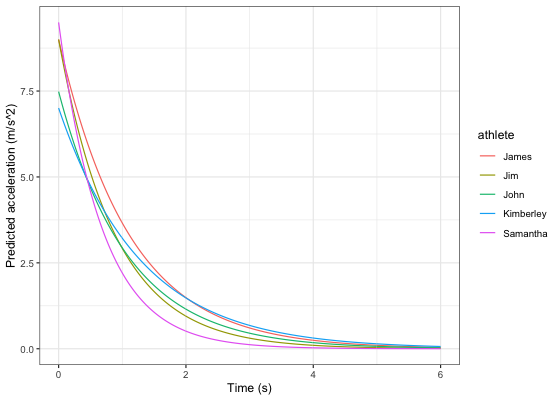

``` r
kable(mixed_model$parameters$random)
```

| athlete   |   MSS |   TAU |  MAC | PMAX | time\_correction | distance\_correction |
|:----------|------:|------:|-----:|-----:|-----------------:|---------------------:|
| James     | 10.00 | 1.111 | 9.00 | 22.5 |                0 |                    0 |
| Jim       |  8.00 | 0.889 | 9.00 | 18.0 |                0 |                    0 |
| John      |  8.00 | 1.069 | 7.48 | 15.0 |                0 |                    0 |
| Kimberley |  9.01 | 1.286 | 7.00 | 15.8 |                0 |                    0 |
| Samantha  |  6.50 | 0.685 | 9.50 | 15.4 |                0 |                    0 |

Let’s plot predicted acceleration over time (0-6sec) for athletes in the
`radar_gun_data` data set:

``` r
model_predictions <- shorts::predict_kinematics(mixed_model)

ggplot(model_predictions, aes(x = time, y = acceleration, color = athlete)) +
  theme_bw() +
  geom_line() +
  xlab("Time (s)") +
  ylab("Predicted acceleration (m/s^2)")
```

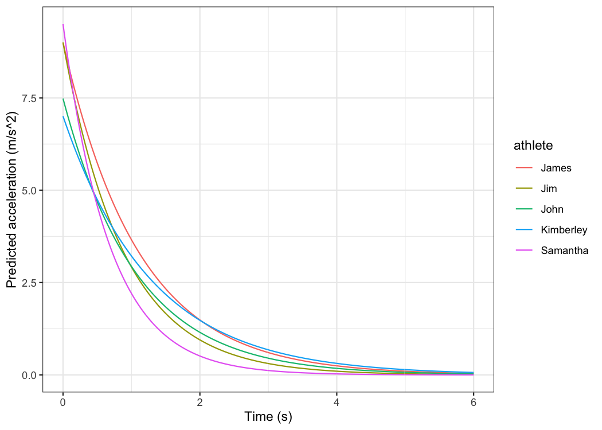

### Force-Velocity Profiling

To estimate Force-Velocity profile using approach by Samozino *et al.*
(2016), use `shorts::get_FV_profile()`:

``` r
kimberley_fv <- shorts::get_FV_profile(
  MSS = kimberley_profile$parameters$MSS,
  TAU = kimberley_profile$parameters$TAU,
  # These are needed to estimate air resistance
  bodymass = kimberley_bodymass,
  bodyheight = kimberley_bodyheight
)

kimberley_fv
#> Estimated Force-Velocity Profile
#> --------------------------
#>      bodymass            F0        F0_rel            V0          Pmax 
#>      6.00e+01      6.30e+02      1.05e+01      8.83e+00      1.39e+03 
#> Pmax_relative      FV_slope  RFmax_cutoff         RFmax           Drf 
#>      2.32e+01     -1.19e+00      3.00e-01      5.99e-01     -1.04e-01 
#>        RSE_FV       RSE_Drf 
#>      9.95e-01      9.46e-03

plot(kimberley_fv) +
  theme_bw()
```

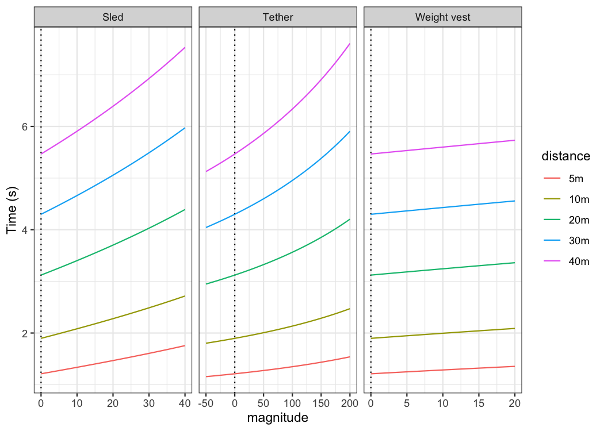

### Using corrections

You have probably noticed that estimated MSS and TAU were a bit too high
for splits data. Biased estimates are due to differences in starting
positions and *timing triggering methods* for certain measurement
approaches (e.g. starting behind first timing gate, or allowing for body
rocking). This topic is further explained in `sprint-corrections`
[vignette](https://mladenjovanovic.github.io/shorts/articles/sprint-corrections.html)
that can be accessed by typing:

``` r
vignette("sprint-corrections")
```

Here I will provide quick summary. Often, this bias in estimates is
dealt with by using heuristic rule of thumb of adding `time_correction`
to split times (e.g. from 0.3-0.5sec; see more in Haugen *et al.*,
2012). This functionality is available in all covered `shorts`
functions:

``` r
mixed_model_corrected <- shorts::mixed_model_using_splits(
  data = split_times,
  distance = "distance",
  time = "time",
  athlete = "athlete", 
  time_correction = 0.3
)

mixed_model_corrected
#> Estimated fixed model parameters
#> --------------------------------
#>                 MSS                 TAU                 MAC                PMAX 
#>                8.47                1.15                7.34               15.55 
#>     time_correction distance_correction 
#>                0.30                0.00 
#> 
#> Estimated random model parameters
#> ----------------------------------
#>     athlete   MSS   TAU  MAC PMAX time_correction distance_correction
#> 1     James 10.55 1.495 7.05 18.6             0.3                   0
#> 2       Jim  8.05 0.922 8.73 17.6             0.3                   0
#> 3      John  8.13 1.230 6.61 13.4             0.3                   0
#> 4 Kimberley  9.11 1.372 6.64 15.1             0.3                   0
#> 5  Samantha  6.53 0.756 8.64 14.1             0.3                   0
#> 
#> Model fit estimators
#> --------------------
#>       RSE R_squared    minErr    maxErr maxAbsErr      RMSE       MAE      MAPE 
#>   0.01520   0.99994  -0.04116   0.02030   0.04116   0.01244   0.00909   0.49682

summary(mixed_model_corrected)
#> Nonlinear mixed-effects model fit by maximum likelihood
#>   Model: corrected_time ~ TAU * I(LambertW::W(-exp(1)^(-distance/(MSS *      TAU) - 1))) + distance/MSS + TAU 
#>   Data: train 
#>     AIC   BIC logLik
#>   -96.9 -88.5   54.5
#> 
#> Random effects:
#>  Formula: list(MSS ~ 1, TAU ~ 1)
#>  Level: athlete
#>  Structure: General positive-definite, Log-Cholesky parametrization
#>          StdDev Corr 
#> MSS      1.3285 MSS  
#> TAU      0.2779 0.924
#> Residual 0.0152      
#> 
#> Fixed effects:  MSS + TAU ~ 1 
#>     Value Std.Error DF t-value p-value
#> MSS  8.47     0.616 24   13.76       0
#> TAU  1.15     0.129 24    8.93       0
#>  Correlation: 
#>     MSS  
#> TAU 0.923
#> 
#> Standardized Within-Group Residuals:
#>    Min     Q1    Med     Q3    Max 
#> -1.336 -0.407 -0.133  0.328  2.708 
#> 
#> Number of Observations: 30
#> Number of Groups: 5

plot(mixed_model_corrected) +
  theme_bw()
```

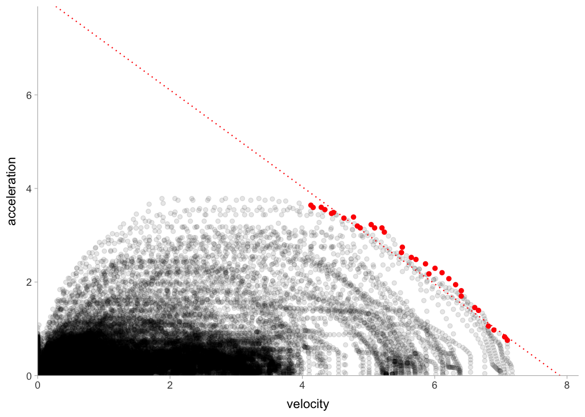

``` r
kable(mixed_model_corrected$parameters$random)
```

| athlete   |   MSS |   TAU |  MAC | PMAX | time\_correction | distance\_correction |
|:----------|------:|------:|-----:|-----:|-----------------:|---------------------:|
| James     | 10.55 | 1.495 | 7.05 | 18.6 |              0.3 |                    0 |
| Jim       |  8.05 | 0.922 | 8.73 | 17.6 |              0.3 |                    0 |
| John      |  8.13 | 1.230 | 6.61 | 13.4 |              0.3 |                    0 |
| Kimberley |  9.12 | 1.372 | 6.64 | 15.1 |              0.3 |                    0 |
| Samantha  |  6.53 | 0.756 | 8.64 | 14.1 |              0.3 |                    0 |

And `time_correction` can also be used in `predict_XXX()` and
`find_XXX()` family of functions:

``` r
velocity_over_distance_corrected <- merge(
    mixed_model_corrected$parameters$random,
    data.frame(distance = seq(0, 40, length.out = 1000))
)

velocity_over_distance_corrected$pred_velocity <- with(velocity_over_distance,
  shorts::predict_velocity_at_distance(
    distance = distance,
    MSS = MSS,
    TAU = TAU,
    time_correction = 0.3)
)

ggplot(velocity_over_distance_corrected, aes(x = distance, y = pred_velocity, color = athlete)) +
  theme_bw() +
  geom_line() +
  xlab("Distance (m)") +
  ylab("Predicted velocity (m/s)")
```


Instead of providing for `time_correction`, this parameter can be
estimated using `shorts::model_using_splits_with_time_correction()` and
`shorts::mixed_model_using_splits_with_time_correction()`:

``` r
kimberley_profile_with_time_correction <- shorts::model_using_splits_with_time_correction(
  distance = kimberley_data$distance,
  time = kimberley_data$time)  

kimberley_profile_with_time_correction
#> Estimated model parameters
#> --------------------------
#>                 MSS                 TAU                 MAC                PMAX 
#>               8.975               1.235               7.268              16.307 
#>     time_correction distance_correction 
#>               0.235               0.000 
#> 
#> Model fit estimators
#> --------------------
#>       RSE R_squared    minErr    maxErr maxAbsErr      RMSE       MAE      MAPE 
#>  0.001129  1.000000 -0.001209  0.001181  0.001209  0.000798  0.000659  0.028235

# Mixed-effect model using `time_correction` as fixed effect only
# To use `time_correction` as random effects, use random = MSS + TAU + time_correction ~ 1
mixed_model_with_time_correction <- shorts::mixed_model_using_splits_with_time_correction(
  data = split_times,
  distance = "distance",
  time = "time",
  athlete = "athlete"
)

# Parameters
mixed_model_with_time_correction
#> Estimated fixed model parameters
#> --------------------------------
#>                 MSS                 TAU                 MAC                PMAX 
#>               8.304               0.969               8.572              17.796 
#>     time_correction distance_correction 
#>               0.199               0.000 
#> 
#> Estimated random model parameters
#> ----------------------------------
#>     athlete   MSS   TAU   MAC PMAX time_correction distance_correction
#> 1     James 10.19 1.243  8.20 20.9           0.199                   0
#> 2       Jim  7.95 0.764 10.40 20.7           0.199                   0
#> 3      John  8.00 1.049  7.62 15.2           0.199                   0
#> 4 Kimberley  8.90 1.162  7.66 17.0           0.199                   0
#> 5  Samantha  6.49 0.626 10.37 16.8           0.199                   0
#> 
#> Model fit estimators
#> --------------------
#>       RSE R_squared    minErr    maxErr maxAbsErr      RMSE       MAE      MAPE 
#>   0.00598   0.99999  -0.01651   0.00937   0.01651   0.00488   0.00348   0.18614


plot(mixed_model_with_time_correction) +
  theme_bw()
```

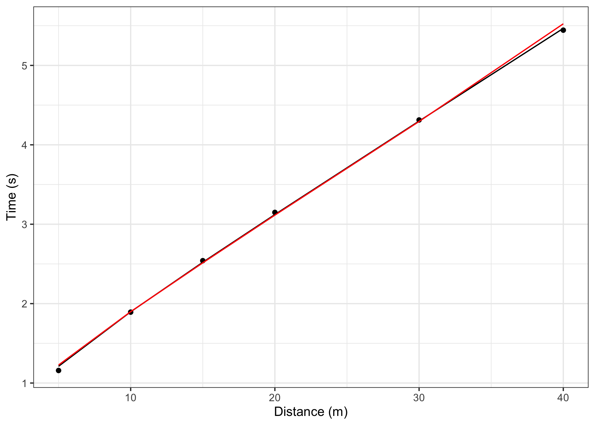

``` r
kable(mixed_model_with_time_correction$parameters$random)
```

| athlete   |   MSS |   TAU |   MAC | PMAX | time\_correction | distance\_correction |
|:----------|------:|------:|------:|-----:|-----------------:|---------------------:|
| James     | 10.19 | 1.243 |  8.20 | 20.9 |            0.199 |                    0 |
| Jim       |  7.95 | 0.764 | 10.40 | 20.7 |            0.199 |                    0 |
| John      |  8.00 | 1.049 |  7.62 | 15.2 |            0.199 |                    0 |
| Kimberley |  8.90 | 1.162 |  7.66 | 17.0 |            0.199 |                    0 |
| Samantha  |  6.49 | 0.626 | 10.37 | 16.8 |            0.199 |                    0 |

For more details, please refer to `sprint-corrections`
[vignette](https://mladenjovanovic.github.io/shorts/articles/sprint-corrections.html).

### Leave-One-Out Cross-Validation (LOOCV)

`...model_using_splits..()` family of functions come with LOOCV feature
that is performed by setting the function parameter `LOOCV = TRUE`. This
feature is very useful for checking model parameters robustness and
model predictions on unseen data. LOOCV involve iterative model building
and testing by removing observation one by one and making predictions
for them. Let’s use Kimberley again, but this time perform LOOCV:

``` r
kimberley_profile_LOOCV <- shorts::model_using_splits(
  distance = kimberley_data$distance,
  time = kimberley_data$time,
  LOOCV = TRUE)  

kimberley_profile_LOOCV
#> Estimated model parameters
#> --------------------------
#>                 MSS                 TAU                 MAC                PMAX 
#>               8.591               0.811              10.589              22.743 
#>     time_correction distance_correction 
#>               0.000               0.000 
#> 
#> Model fit estimators
#> --------------------
#>       RSE R_squared    minErr    maxErr maxAbsErr      RMSE       MAE      MAPE 
#>    0.0340    0.9997   -0.0270    0.0529    0.0529    0.0278    0.0233    1.1926 
#> 
#> 
#> Leave-One-Out Cross-Validation
#> ------------------------------
#> Parameters:
#>    MSS   TAU  MAC PMAX time_correction distance_correction
#> 1 8.69 0.856 10.2 22.1               0                   0
#> 2 8.60 0.815 10.5 22.7               0                   0
#> 3 8.56 0.795 10.8 23.0               0                   0
#> 4 8.57 0.797 10.8 23.0               0                   0
#> 5 8.61 0.813 10.6 22.8               0                   0
#> 6 8.39 0.760 11.1 23.2               0                   0
#> 
#> Model fit:
#>       RSE R_squared    minErr    maxErr maxAbsErr      RMSE       MAE      MAPE 
#>        NA    0.9990   -0.0344    0.0801    0.0801    0.0474    0.0392    1.7227
```

Box-plot is suitable method for plotting estimated parameters:

``` r
LOOCV_parameters <- gather(kimberley_profile_LOOCV$LOOCV$parameters) %>%
  mutate(key = factor(
    key,
    levels = c("MSS", "TAU", "MAC", "PMAX", "time_correction", "distance_correction")
  ))

ggplot(LOOCV_parameters, aes(y = value)) +
  theme_bw() +
  geom_boxplot() +
  facet_wrap(~key, scales = "free") +
  ylab(NULL) +
  theme(axis.ticks.x = element_blank(), axis.text.x = element_blank())
```

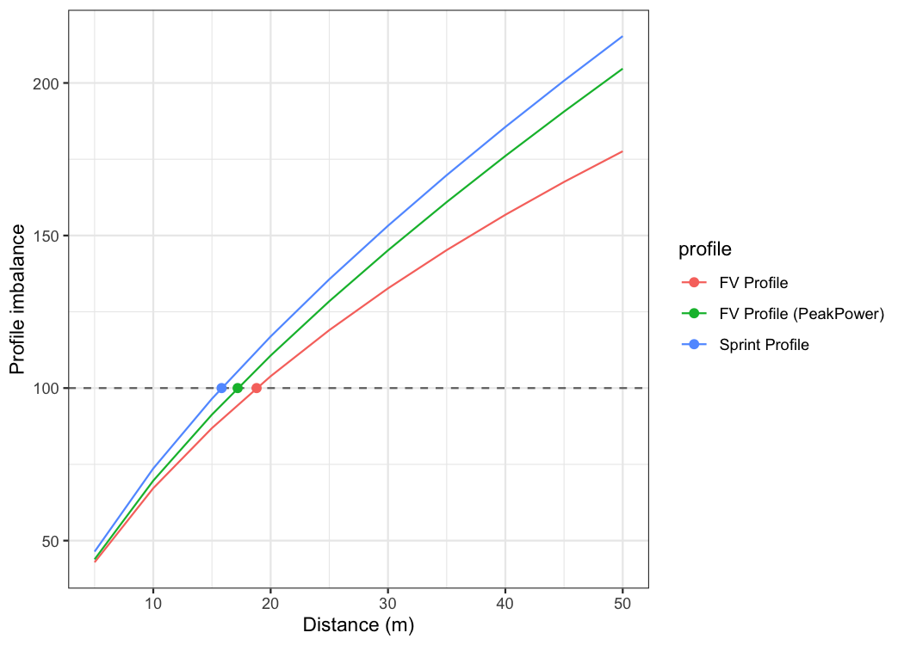

Let’s plot model LOOCV predictions and training (when using all data
set) predictions against observed performance:

``` r
kimberley_data <- kimberley_data %>%
  mutate(
    pred_time = predict(kimberley_profile_LOOCV),
    LOOCV_time = kimberley_profile_LOOCV$LOOCV$data$pred_time
  )

ggplot(kimberley_data, aes(x = distance)) +
  theme_bw() +
  geom_point(aes(y = time)) +
  geom_line(aes(y = pred_time), color = "black") +
  geom_line(aes(y = LOOCV_time), color = "red") +
  xlab("Distance (m)") +
  ylab("Time (s)")
```


Let’s plot predicted velocity using LOOCV estimate parameters to check
robustness of the model predictions:

``` r
plot_data <- kimberley_profile_LOOCV$LOOCV$parameters %>%
  mutate(LOOCV = row_number())

plot_data <- expand_grid(
  data.frame(time = seq(0, 6, length.out = 100)),
  plot_data
) %>%
  mutate(
    LOOCV_velocity = predict_velocity_at_time(
      time = time,
      MSS = MSS,
      TAU = TAU),
    velocity = predict_velocity_at_time(
      time = time,
      MSS = kimberley_profile_LOOCV$parameters$MSS,
      TAU = kimberley_profile_LOOCV$parameters$TAU)
  )

ggplot(plot_data, aes(x = time, y = LOOCV_velocity, group = LOOCV)) +
  theme_bw() +
  geom_line(alpha = 0.8) +
  geom_line(aes(y = velocity), color = "red", size = 0.5) +
  xlab("Time (sec)") +
  ylab("Velocity (m/s)")
```


## Publications

1.  Jovanović, M., Vescovi, J.D. (2020). **shorts: An R Package for
    Modeling Short Sprints**. Preprint available at *SportRxiv*.
    <https://doi.org/10.31236/osf.io/4jw62>

2.  Vescovi, JD and Jovanović, M. **Sprint Mechanical Characteristics of
    Female Soccer Players: A Retrospective Pilot Study to Examine a
    Novel Approach for Correction of Timing Gate Starts.** *Front Sports
    Act Living 3: 629694, 2021.*
    <https://doi.org/10.3389/fspor.2021.629694>

## Citation

To cite `shorts`, please use the following command to get the BibTex
entry:

``` r
citation("shorts")
```

## References

Please refer to these publications for more information on short sprints
modeling using mono-exponential equation, as well as on performing mixed
non-linear models with `nlme` package:

Chelly SM, Denis C. 2001. Leg power and hopping stiffness: relationship
with sprint running performance: Medicine and Science in Sports and
Exercise:326–333. DOI: 10.1097/00005768-200102000-00024.

Clark KP, Rieger RH, Bruno RF, Stearne DJ. 2017. The NFL Combine 40-Yard
Dash: How Important is Maximum Velocity? Journal of Strength and
Conditioning Research:1. DOI: 10.1519/JSC.0000000000002081.

Furusawa K, Hill AV, and Parkinson JL. The dynamics of" sprint" running.
Proceedings of the Royal Society of London. Series B, Containing Papers
of a Biological Character 102 (713): 29-42, 1927

Greene PR. 1986. Predicting sprint dynamics from maximum-velocity
measurements. Mathematical Biosciences 80:1–18. DOI:
10.1016/0025-5564(86)90063-5.

Haugen TA, Tønnessen E, Seiler SK. 2012. The Difference Is in the Start:
Impact of Timing and Start Procedure on Sprint Running Performance:
Journal of Strength and Conditioning Research 26:473–479. DOI:
10.1519/JSC.0b013e318226030b.

Pinheiro J, Bates D, DebRoy S, Sarkar D, R Core Team. 2019. nlme: Linear
and nonlinear mixed effects models.

Samozino P, Rabita G, Dorel S, Slawinski J, Peyrot N, Saez de Villarreal
E, Morin J-B. 2016. A simple method for measuring power, force, velocity
properties, and mechanical effectiveness in sprint running: Simple
method to compute sprint mechanics. Scandinavian Journal of Medicine &
Science in Sports 26:648–658. DOI: 10.1111/sms.12490.

Samozino P. 2018. A Simple Method for Measuring Force, Velocity and
Power Capabilities and Mechanical Effectiveness During Sprint Running.
In: Morin J-B, Samozino P eds. Biomechanics of Training and Testing.
Cham: Springer International Publishing, 237–267. DOI:
10.1007/978-3-319-05633-3\_11.
