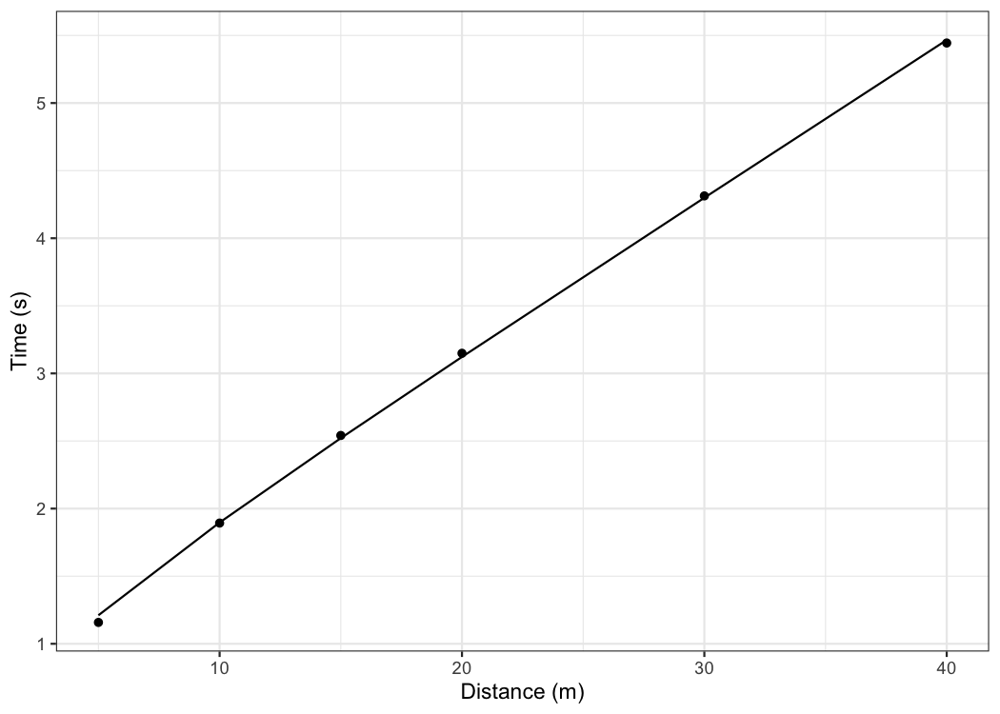
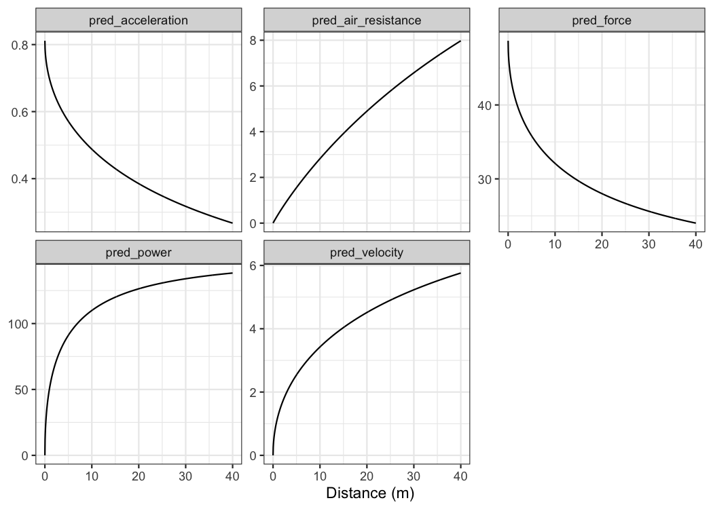
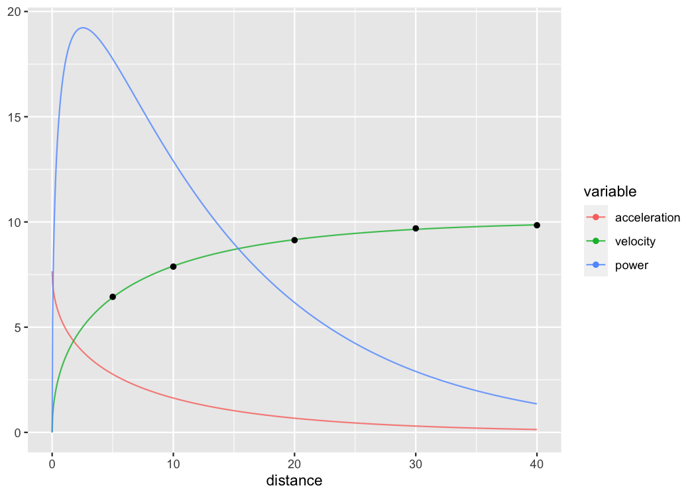
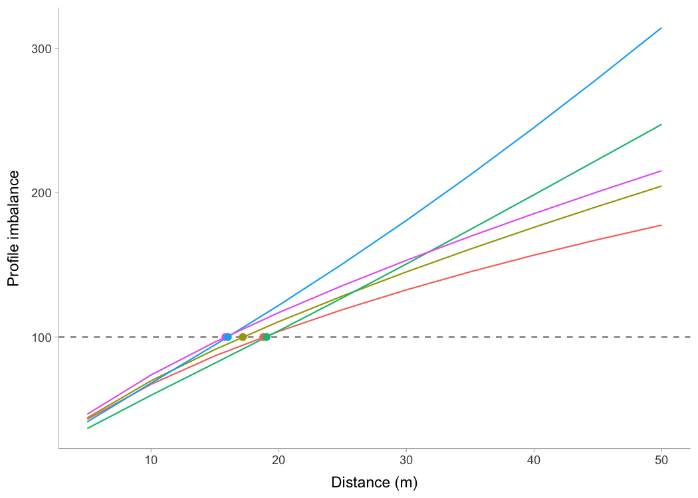

<!-- README.md is generated from README.Rmd. Please edit that file  -->

# shorts 

<!-- badges: start -->

[](https://zenodo.org/badge/latestdoi/254907272)
[](https://github.com/mladenjovanovic/shorts/actions/workflows/R-CMD-check.yaml)
[](https://CRAN.R-project.org/package=shorts)
<!-- badges: end -->

**{shorts}** is an R package aimed for the analysis of the un-resisted
and resisted short sprints (\<6sec; without deceleration), creation of
*acceleration-velocity profiles* (AVP), *force-velocity profiles* (FVP),
and *optimization profiles* using variety of sprint traces (e.g.,
time-velocity from laser/radar gun, distance-time from timing
gates/photocells). It represents a simple to use tool for researcher and
practitioners interested in modeling short sprints performance.

## Installation

``` r
# Install from CRAN
install.packages("shorts")

# Or the development version from GitHub
# install.packages("remotes")
remotes::install_github("mladenjovanovic/shorts")
```

## Examples

**{shorts}** comes with multiple sample data sets. Let’s load
`split_times` and `radar_gun_data` with N=5 athletes:

``` r
library(shorts)
library(tidyverse)
library(knitr)

data("split_times", "radar_gun_data")
```

### Profiling using split times

**{shorts}** package utilizes modified *mono-exponential functions* to
model short sprint performance. To model sprint performance using split
times, distance will be used as predictor and time as target. Since
`split_times` dataset contains data for multiple athletes, let’s extract
only one athlete and model it using `shorts::model_timing_gates()`
function.

``` r
kimberley_data <- filter(split_times, athlete == "Kimberley")

kable(kimberley_data)
```

| athlete   | bodyweight | distance | time |
|:----------|-----------:|---------:|-----:|
| Kimberley |         55 |        5 | 1.16 |
| Kimberley |         55 |       10 | 1.89 |
| Kimberley |         55 |       15 | 2.54 |
| Kimberley |         55 |       20 | 3.15 |
| Kimberley |         55 |       30 | 4.31 |
| Kimberley |         55 |       40 | 5.44 |

Parameters estimated using mono-exponential equation are *maximal
sprinting speed* ($MSS$), and *maximal acceleration* (MAC). Additional
parameters computed from $MSS$ and $MAC$ are *relative acceleration*
($TAU$) and *maximal relative power* ($PMAX$) (which is calculated as
$MAC \cdot MSS\div4$).

``` r
kimberley_profile <- shorts::model_timing_gates(
  distance = kimberley_data$distance,
  time = kimberley_data$time
)

kimberley_profile
#> Estimated model parameters
#> --------------------------
#>    MSS    MAC    TAU   PMAX 
#>  8.591 10.589  0.811 22.743 
#> 
#> Model fit estimators
#> --------------------
#>             R2        meanErr   meanErr_perc         minErr 
#>        0.99966       -0.00309       -0.53860       -0.05293 
#>    minErr_perc         maxErr    maxErr_perc      maxAbsErr 
#>       -4.57121        0.02699        0.85715        0.05293 
#> maxAbsErr_perc           RMSE      RMSE_perc            MAE 
#>        4.57121        0.02779        1.93922        0.02333 
#>       MAE_perc 
#>        1.19263

summary(kimberley_profile)
#> 
#> Formula: time ~ predict_time_at_distance(distance, MSS, MAC)
#> 
#> Parameters:
#>     Estimate Std. Error t value   Pr(>|t|)    
#> MSS    8.591      0.123    70.1 0.00000025 ***
#> MAC   10.589      0.460    23.0 0.00002108 ***
#> ---
#> Signif. codes:  0 '***' 0.001 '**' 0.01 '*' 0.05 '.' 0.1 ' ' 1
#> 
#> Residual standard error: 0.034 on 4 degrees of freedom
#> 
#> Number of iterations to convergence: 5 
#> Achieved convergence tolerance: 0.0000000149

coef(kimberley_profile)
#>   MSS   MAC 
#>  8.59 10.59

confint(kimberley_profile, level = 0.95)
#>     2.5% 97.5%
#> MSS 8.27  8.96
#> MAC 9.42 12.02
```

To return the predicted/fitted values (in this case time variable), use
`predict()` function:

``` r
predict(kimberley_profile)
#> [1] 1.21 1.90 2.52 3.12 4.30 5.47
```

To create a simple plot use S3 `plot()` method. There are four type
options: `"model"` (default), `"kinematics-time"`,
`"kinematics-distance"`, or `"residuals"`:

``` r
plot(kimberley_profile)
```


``` r
plot(kimberley_profile, "kinematics-time")
```



``` r
plot(kimberley_profile, "kinematics-distance")
```


``` r
plot(kimberley_profile, "residuals")
```


If you are interested in calculating average split velocity, use
`shorts::format_splits()`

``` r
kable(shorts::format_splits(
  distance = kimberley_data$distance,
  time = kimberley_data$time
))
```

| split | split_distance_start | split_distance_stop | split_distance | split_time_start | split_time_stop | split_time | split_mean_velocity | split_mean_acceleration |
|------:|---------------------:|--------------------:|---------------:|-----------------:|----------------:|-----------:|--------------------:|------------------------:|
|     1 |                    0 |                   5 |              5 |             0.00 |            1.16 |      1.158 |                4.32 |                   3.729 |
|     2 |                    5 |                  10 |              5 |             1.16 |            1.89 |      0.735 |                6.80 |                   3.381 |
|     3 |                   10 |                  15 |              5 |             1.89 |            2.54 |      0.648 |                7.72 |                   1.409 |
|     4 |                   15 |                  20 |              5 |             2.54 |            3.15 |      0.608 |                8.22 |                   0.835 |
|     5 |                   20 |                  30 |             10 |             3.15 |            4.31 |      1.164 |                8.59 |                   0.316 |
|     6 |                   30 |                  40 |             10 |             4.31 |            5.44 |      1.131 |                8.84 |                   0.222 |

To plot predicted velocity, acceleration, air resistance, force, and
power over distance, use `shorts:predict_XXX()`. Please note that to
calculate force, air resistance, and power, we need Kimberley’s bodymass
and height (as well as other characteristics such as air pressure,
temperature and wind - see `get_air_resistance()` function).

``` r
kimberley_bodymass <- 60 # in kilograms
kimberley_bodyheight <- 1.7 # in meters

kimberley_pred <- tibble(
  distance = seq(0, 40, length.out = 1000),

  # Velocity
  pred_velocity = shorts::predict_velocity_at_distance(
    distance,
    kimberley_profile$parameters$MSS,
    kimberley_profile$parameters$TAU
  ),

  # Acceleration
  pred_acceleration = shorts::predict_acceleration_at_distance(
    distance,
    kimberley_profile$parameters$MSS,
    kimberley_profile$parameters$TAU
  ),

  # Air resistance
  pred_air_resistance = shorts::predict_air_resistance_at_distance(
    distance,
    kimberley_profile$parameters$MSS,
    kimberley_profile$parameters$TAU,
    bodymass = kimberley_bodymass,
    bodyheight = kimberley_bodyheight
  ),

  # Force
  pred_force = shorts::predict_force_at_distance(
    distance,
    kimberley_profile$parameters$MSS,
    kimberley_profile$parameters$TAU,
    bodymass = kimberley_bodymass,
    bodyheight = kimberley_bodyheight
  ),

  # Power
  pred_power = shorts::predict_power_at_distance(
    distance,
    kimberley_profile$parameters$MSS,
    kimberley_profile$parameters$TAU,
    bodymass = kimberley_bodymass,
    bodyheight = kimberley_bodyheight
  ),
)

# Convert to long
kimberley_pred <- gather(kimberley_pred, "metric", "value", -distance)

ggplot(kimberley_pred, aes(x = distance, y = value)) +
  geom_line() +
  facet_wrap(~metric, scales = "free_y") +
  xlab("Distance (m)") +
  ylab(NULL)
```



To do prediction simpler, use `shorts::predict_kinematics()` function.
This will provide kinetics and kinematics for 0-6 $s$ sprint using 100
$Hz$.

``` r
predicted_kinematics <- predict_kinematics(
  kimberley_profile,
  bodymass = kimberley_bodymass,
  bodyheight = kimberley_bodyheight
)

kable(head(predicted_kinematics))
```

| time | distance | velocity | acceleration | bodymass | inertia | resistance | air_resistance | horizontal_force | horizontal_force_relative | vertical_force | resultant_force | resultant_force_relative | power | power_relative |  work | average_power | average_power_relative |    RF | force_angle |
|-----:|---------:|---------:|-------------:|---------:|--------:|-----------:|---------------:|-----------------:|--------------------------:|---------------:|----------------:|-------------------------:|------:|---------------:|------:|--------------:|-----------------------:|------:|------------:|
| 0.00 |    0.000 |    0.000 |        10.59 |       60 |       0 |          0 |          0.000 |              635 |                     10.59 |            589 |             866 |                     14.4 |     0 |           0.00 | 0.000 |               |                        | 0.734 |        42.8 |
| 0.01 |    0.001 |    0.105 |        10.46 |       60 |       0 |          0 |          0.003 |              628 |                     10.46 |            589 |             860 |                     14.3 |    66 |           1.10 | 0.332 |          33.2 |                  0.554 | 0.729 |        43.2 |
| 0.02 |    0.002 |    0.209 |        10.33 |       60 |       0 |          0 |          0.011 |              620 |                     10.33 |            589 |             855 |                     14.2 |   130 |           2.16 | 1.313 |          65.6 |                  1.094 | 0.725 |        43.5 |
| 0.03 |    0.005 |    0.312 |        10.21 |       60 |       0 |          0 |          0.023 |              612 |                     10.21 |            589 |             849 |                     14.2 |   191 |           3.18 | 2.918 |          97.3 |                  1.621 | 0.721 |        43.9 |
| 0.04 |    0.008 |    0.413 |        10.08 |       60 |       0 |          0 |          0.041 |              605 |                     10.08 |            589 |             844 |                     14.1 |   250 |           4.17 | 5.124 |         128.1 |                  2.135 | 0.717 |        44.2 |
| 0.05 |    0.013 |    0.513 |         9.96 |       60 |       0 |          0 |          0.063 |              597 |                      9.96 |            589 |             839 |                     14.0 |   307 |           5.11 | 7.910 |         158.2 |                  2.637 | 0.712 |        44.6 |

To get model residuals, use `residuals()` function:

``` r
residuals(kimberley_profile)
#> [1] -0.05293 -0.00402  0.01997  0.02699  0.01376 -0.02232
```

Package **{shorts}** comes with `find_XXX()` family of functions that
allow finding peak power and it’s location, as well as *critical
distance* over which velocity, acceleration, or power drops below
certain threshold:

``` r
# Peak power and location
shorts::find_peak_power_distance(
  MSS = kimberley_profile$parameters$MSS,
  MAC = kimberley_profile$parameters$MAC, 
  bodymass = kimberley_bodymass,
  bodyheight = kimberley_bodyheight
)
#> $peak_power
#> [1] 1384
#> 
#> $distance
#> [1] 1.42

# Distance over which power is over 80%
shorts::find_power_critical_distance(
  MSS = kimberley_profile$parameters$MSS,
  MAC = kimberley_profile$parameters$MAC, 
  bodymass = kimberley_bodymass,
  bodyheight = kimberley_bodyheight,
  percent = 0.8
)
#> $lower
#> [1] 0.342
#> 
#> $upper
#> [1] 4.27

# Distance over which acceleration is under 50%
shorts::find_acceleration_critical_distance(
  MSS = kimberley_profile$parameters$MSS,
  MAC = kimberley_profile$parameters$MAC,
  percent = 0.5
)
#> [1] 1.35

# Distance over which velocity is over 95%
shorts::find_velocity_critical_distance(
  MSS = kimberley_profile$parameters$MSS,
  MAC = kimberley_profile$parameters$MAC,
  percent = 0.95
)
#> [1] 14.3
```

### Profiling using radar gun data

The radar gun data is modeled using measured velocity as target variable
and time as predictor. Individual analysis is performed using
`shorts::model_radar_gun()` function or `shorts::model_laser_gun()`
(they are aliases). Let’s do analysis for Jim:

``` r
jim_data <- filter(radar_gun_data, athlete == "Jim")

jim_profile <- shorts::model_radar_gun(
  time = jim_data$time,
  velocity = jim_data$velocity
)

jim_profile
#> Estimated model parameters
#> --------------------------
#>    MSS    MAC    TAU   PMAX 
#>  7.998  8.999  0.889 17.993 
#> 
#> Estimated model corrections
#> --------------------------
#>       TC 
#> -0.00011 
#> 
#> Model fit estimators
#> --------------------
#>             R2        meanErr   meanErr_perc         minErr 
#>   0.9992440860  -0.0000000248           -Inf  -0.1640450506 
#>    minErr_perc         maxErr    maxErr_perc      maxAbsErr 
#>           -Inf   0.1511233656   2.3325106593   0.1640450506 
#> maxAbsErr_perc           RMSE      RMSE_perc            MAE 
#>            Inf   0.0505025383            Inf   0.0392723633 
#>       MAE_perc 
#>            Inf

summary(jim_profile)
#> 
#> Formula: velocity ~ predict_velocity_at_time(time - TC, MSS, MAC)
#> 
#> Parameters:
#>     Estimate Std. Error t value            Pr(>|t|)    
#> MSS  7.99801    0.00319 2504.55 <0.0000000000000002 ***
#> MAC  8.99871    0.01997  450.61 <0.0000000000000002 ***
#> TC  -0.00011    0.00123   -0.09                0.93    
#> ---
#> Signif. codes:  0 '***' 0.001 '**' 0.01 '*' 0.05 '.' 0.1 ' ' 1
#> 
#> Residual standard error: 0.0506 on 597 degrees of freedom
#> 
#> Number of iterations to convergence: 4 
#> Achieved convergence tolerance: 0.0000000149

confint(jim_profile)
#>         2.5%   97.5%
#> MSS  7.99175 8.00429
#> MAC  8.95959 9.03797
#> TC  -0.00253 0.00229

plot(jim_profile)
```



In addition to $MSS$ and $MAC$ parameters, `shorts::model_radar_gun()`
function also estimated *time-correction* ($TC$) parameter.

Rather than estimating $MSS$, `shorts::model_radar_gun()` function
allows you to utilize peak velocity observed in the data as $MSS$. This
is done by setting the `use_observed_MSS` parameter to `TRUE`:

``` r
jim_profile <- shorts::model_radar_gun(
  time = jim_data$time,
  velocity = jim_data$velocity,
  use_observed_MSS = TRUE
)

jim_profile
#> Estimated model parameters
#> --------------------------
#>    MSS    MAC    TAU   PMAX 
#>  8.095  8.678  0.933 17.563 
#> 
#> Estimated model corrections
#> --------------------------
#>      TC 
#> -0.0112 
#> 
#> Model fit estimators
#> --------------------
#>             R2        meanErr   meanErr_perc         minErr 
#>         0.9988        -0.0388           -Inf        -0.2287 
#>    minErr_perc         maxErr    maxErr_perc      maxAbsErr 
#>           -Inf         0.1825         2.8174         0.2287 
#> maxAbsErr_perc           RMSE      RMSE_perc            MAE 
#>            Inf         0.0798            Inf         0.0643 
#>       MAE_perc 
#>            Inf

summary(jim_profile)
#> 
#> Formula: velocity ~ predict_velocity_at_time(time - TC, MSS, MAC)
#> 
#> Parameters:
#>     Estimate Std. Error t value             Pr(>|t|)    
#> MSS  8.09500    0.00521 1554.10 < 0.0000000000000002 ***
#> MAC  8.67822    0.03017  287.60 < 0.0000000000000002 ***
#> TC  -0.01118    0.00203   -5.52          0.000000051 ***
#> ---
#> Signif. codes:  0 '***' 0.001 '**' 0.01 '*' 0.05 '.' 0.1 ' ' 1
#> 
#> Residual standard error: 0.08 on 597 degrees of freedom
#> 
#> Number of iterations to convergence: 5 
#> Achieved convergence tolerance: 0.0000000149
```

### Profiling using tether devices

Some tether devices provide data out in a velocity-at-distance format.
In this case, velocity is the outcome variable and distance is the
predictor. To estimate sprint profiles from *tether data*, use
`shorts::model_tether()` function.

``` r
# This creates sprint trace
tether_df <- shorts::create_sprint_trace(
  MSS = 7, MAC = 6,
  time = seq(0.01, 6, by = 0.01))

m1 <- model_tether(
  distance = tether_df$distance,
  velocity = tether_df$velocity)

m1
#> Estimated model parameters
#> --------------------------
#>   MSS   MAC   TAU  PMAX 
#>  7.00  6.00  1.17 10.50 
#> 
#> Model fit estimators
#> --------------------
#>                    R2               meanErr 
#>  0.999999999999999778  0.000000000000000464 
#>          meanErr_perc                minErr 
#>  0.000000000000849181 -0.000000000000038081 
#>           minErr_perc                maxErr 
#> -0.000000000032006657  0.000000000000298428 
#>           maxErr_perc             maxAbsErr 
#>  0.000000000499514588  0.000000000000298428 
#>        maxAbsErr_perc                  RMSE 
#>  0.000000000499514588  0.000000000000012599 
#>             RMSE_perc                   MAE 
#>  0.000000000020448893  0.000000000000001438 
#>              MAE_perc 
#>  0.000000000000981334

plot(m1)
```


Setting `use_observed_MSS` parameter to `TRUE` in the
`shorts::model_tether()` function also allows you to use observed *peak
velocity* as $MSS$.

In the case when distance is not centered at zero, use
`shorts::model_tether_DC()` which also estimated the *distance
correction* ($DC$) parameter, serving as model intercept (for more info
see [Using corrections](#using-corrections) section):

``` r
# This creates sprint trace
tether_df <- shorts::create_sprint_trace(
  MSS = 7, MAC = 6,
  time = seq(0.001, 6, by = 0.01), 
  # Add distance shift
  DC = 5)

m1 <- model_tether_DC(
  distance = tether_df$distance,
  velocity = tether_df$velocity)

m1
#> Estimated model parameters
#> --------------------------
#>   MSS   MAC   TAU  PMAX 
#>  7.00  6.00  1.17 10.50 
#> 
#> Estimated model corrections
#> --------------------------
#> DC 
#>  5 
#> 
#> Model fit estimators
#> --------------------
#>               R2          meanErr     meanErr_perc 
#>  1.0000000000000  0.0000000000648  0.0000008098034 
#>           minErr      minErr_perc           maxErr 
#> -0.0000000000152 -0.0000000002897  0.0000000287380 
#>      maxErr_perc        maxAbsErr   maxAbsErr_perc 
#>  0.0004791725496  0.0000000287380  0.0004791725496 
#>             RMSE        RMSE_perc              MAE 
#>  0.0000000011812  0.0000195628726  0.0000000000741 
#>         MAE_perc 
#>  0.0000008099718

plot(m1)
```


### Embedded (i.e., *in-situ*) Profiling

With the modern technologies like GPS and LPS, session acceleration and
velocity can be tracked continuously. This provides an opportunity to
estimate short sprint profiles from *in-situ*, without the need for
explicit testing (assuming the maximal effort was performed). The
analysis is based on the theoretical model where acceleration and
velocity have linear relationship (i.e., mono-exponential model applied
thus far). The time frame of the analysis can vary from single drills
(e.g., sprint drills), session, week, to multiple weeks.

Here is an example of the data collected during one basketball session
for a single person. Duration was approx. 90 min with 20 $Hz$ sampling
rate. This is the positional data:

``` r
data("LPS_session")

LPS_session %>%
  ggplot(aes(x = x, y = y)) +
  geom_point(alpha = 0.1)
```


The next figure plots instant acceleration and velocity:

``` r
LPS_session %>%
  ggplot(aes(x = velocity, y = acceleration)) +
  geom_point(alpha = 0.1)
```


To estimate embedded short sprint profile, we need to filter out
positive acceleration and velocities over 3 $ms{-1}$ (default), then
filter few top acceleration observations per velocity bracket (for more
information please see Clavel *et al.* (2023)). Here is the graphical
representation:

``` r
embedded_model <- model_in_situ(
  LPS_session$velocity,
  LPS_session$acceleration,
  velocity_threshold = 4)
                                
LPS_session %>%
  filter(acceleration > 0) %>%
  ggplot(aes(x = velocity, y = acceleration)) +
  geom_point(alpha = 0.1) +
  geom_point(
    data = embedded_model$data, 
    color = "red"
  ) +
  geom_abline(
    intercept = embedded_model$parameters$MAC,
    slope = -embedded_model$parameters$MAC / embedded_model$parameters$MSS,
    linetype = "dotted", color = "red") +
  scale_x_continuous(expand = c(0, 0), limits = c(0, embedded_model$parameters$MSS)) +
  scale_y_continuous(expand = c(0, 0), limits = c(0, embedded_model$parameters$MAC))
```


### Force-Velocity Profiling

To estimate *Force-Velocity Profile* (FVP) using approach by Samozino
*et al.* (2016, 2022) use `shorts::create_FVP()`:

``` r
kimberley_fv <- shorts::create_FVP(
  MSS = kimberley_profile$parameters$MSS,
  MAC = kimberley_profile$parameters$MAC,
  # These are needed to estimate air resistance
  bodymass = kimberley_bodymass,
  bodyheight = kimberley_bodyheight
)

kimberley_fv
#> $bodymass
#> [1] 60
#> 
#> $F0
#> [1] 635
#> 
#> $F0_rel
#> [1] 10.6
#> 
#> $V0
#> [1] 8.85
#> 
#> $Pmax
#> [1] 1405
#> 
#> $Pmax_rel
#> [1] 23.4
#> 
#> $FV_slope
#> [1] -1.2
```

To convert back to *Acceleration-Velocity Profile* (AVP), use:

``` r
kimberley_avp <- shorts::convert_FVP(
  F0 = kimberley_fv$F0,
  V0 = kimberley_fv$V0,
  bodymass = kimberley_bodymass,
  bodyheight = kimberley_bodyheight
)

kimberley_avp
#> $MSS
#> [1] 8.59
#> 
#> $MAC
#> [1] 10.6
```

#### Using external load

**{shorts}** package also allows utilizing external load in estimating
FVP, as well as using FVP parameters to predict kinematic and kinetic
variables. External load is represented either with additional
**inertia** (i.e., weight vest), horizontal **resistance** (i.e., tether
device that create additional resistance or help, or a hill sprinting),
or both (i.e., a sled, which have both inertia and resistance due to
friction forces). One might also consider head and tail wind as a form
of resistance (or assistance).

Let’s see how theoretical model, assuming FVP is *determinant of
performance* (which I do not agree with, BTW), predicts changes in
sprint characteristics (i.e., $MSS$ and $MAC$) under different external
load conditions and magnitudes using Kimberley’s estimated FVP:

``` r
loads_df <- rbind(
  tibble(type = "Weight vest", magnitude = seq(0, 20, length.out = 100), inertia = magnitude, resistance = 0),
  tibble(type = "Tether", magnitude = seq(-50, 200, length.out = 100), inertia = 0, resistance = magnitude),
  tibble(type = "Sled", magnitude = seq(0, 40, length.out = 100), inertia = magnitude, resistance = magnitude * 9.81 * 0.4)
) %>%
  mutate(
    data.frame(shorts::convert_FVP(
      F0 = kimberley_fv$F0,
      V0 = kimberley_fv$V0,
      bodymass = kimberley_bodymass,
      bodyheight = kimberley_bodyheight,
      inertia = inertia,
      resistance = resistance
    ))
  ) 

loads_df %>%
  pivot_longer(cols = c(MSS, MAC), names_to = "parameter") %>%
  ggplot(aes(x = magnitude, y = value, color = parameter)) +
  geom_vline(xintercept = 0, linetype = "dotted") +
  geom_line() +
  facet_wrap(~type, scales = "free_x") +
  ylab(NULL)
```


Following figure depicts the effect on split times under different load
types and magnitudes, assuming FVP to be determinant of performance
(i.e., causal mechanism):

``` r
dist_df <- expand_grid(
  loads_df,
  distance = c(5, 10, 20, 30, 40)
) %>%
  mutate(
    time = predict_time_at_distance(distance, MSS, MAC),
    distance = factor(
      paste0(distance, "m"), levels = c("5m", "10m", "20m", "30m", "40m"))
  ) 

dist_df %>%
  ggplot(aes(x = magnitude, y = time, color = distance)) +
  geom_vline(xintercept = 0, linetype = "dotted") +
  geom_line() +
  facet_wrap(~type, scales = "free_x") +
  ylab("Time (s)")
```


One can use external resistance when predicting force or power:

``` r
shorts::predict_force_at_time(
  time = 0.5,
  MSS = 9,
  MAC = 7,
  bodymass = 75,
  inertia = 20,
  resistance = 50)
#> [1] 503

shorts::predict_power_at_time(
  time = 0.5,
  MSS = 9,
  MAC = 7,
  bodymass = 75,
  inertia = 20,
  resistance = 50)
#> [1] 1459

shorts::predict_time_at_distance_FV(
  distance = 10,
  F0 = 750,
  V0 = 8,
  bodymass = 75,
  inertia = 20,
  resistance = 50)
#> [1] 2.26
```

External resistances can also be utilized in the
[Optimization](#optimization) functions, covered later.

### Using corrections

You have probably noticed that estimated $MSS$ and $TAU$ were a bit too
high for splits data. Biased estimates are due to differences in
starting positions and *timing triggering methods* for certain
measurement approaches (e.g. starting behind first timing gate, or
allowing for body rocking).

Here I will provide quick summary (see more in Jovanović M., 2023).
Often, this bias in estimates is dealt with by using heuristic rule of
thumb of adding time correction (`time_correction`) to split times
(e.g. from 0.3-0.5 $sec$; see more in Haugen *et al.*, 2012). To do
this, just add time correction to time split:

``` r
kimberley_profile_fixed_TC <- shorts::model_timing_gates(
  distance = kimberley_data$distance,
  time = kimberley_data$time + 0.3
)

kimberley_profile_fixed_TC
#> Estimated model parameters
#> --------------------------
#>   MSS   MAC   TAU  PMAX 
#>  9.13  6.63  1.38 15.12 
#> 
#> Model fit estimators
#> --------------------
#>             R2        meanErr   meanErr_perc         minErr 
#>        0.99997        0.00101        0.12559       -0.00769 
#>    minErr_perc         maxErr    maxErr_perc      maxAbsErr 
#>       -0.22296        0.01640        1.12474        0.01640 
#> maxAbsErr_perc           RMSE      RMSE_perc            MAE 
#>        1.12474        0.00814        0.47704        0.00639 
#>       MAE_perc 
#>        0.28570

summary(kimberley_profile_fixed_TC)
#> 
#> Formula: time ~ predict_time_at_distance(distance, MSS, MAC)
#> 
#> Parameters:
#>     Estimate Std. Error t value     Pr(>|t|)    
#> MSS   9.1278     0.0536     170 0.0000000071 ***
#> MAC   6.6257     0.0657     101 0.0000000579 ***
#> ---
#> Signif. codes:  0 '***' 0.001 '**' 0.01 '*' 0.05 '.' 0.1 ' ' 1
#> 
#> Residual standard error: 0.00997 on 4 degrees of freedom
#> 
#> Number of iterations to convergence: 5 
#> Achieved convergence tolerance: 0.0000000149

coef(kimberley_profile_fixed_TC)
#>  MSS  MAC 
#> 9.13 6.63
```

Instead of providing for `TC`, this parameter can be estimated using
`shorts::model_timing_gates_TC()`.

``` r
kimberley_profile_TC <- shorts::model_timing_gates_TC(
  distance = kimberley_data$distance,
  time = kimberley_data$time
)

kimberley_profile_TC
#> Estimated model parameters
#> --------------------------
#>   MSS   MAC   TAU  PMAX 
#>  8.97  7.27  1.23 16.31 
#> 
#> Estimated model corrections
#> --------------------------
#>     TC 
#> -0.235 
#> 
#> Model fit estimators
#> --------------------
#>               R2          meanErr     meanErr_perc 
#>  0.9999996942338  0.0000000000185  0.0018162748771 
#>           minErr      minErr_perc           maxErr 
#> -0.0011807344888 -0.0623737183716  0.0012094657303 
#>      maxErr_perc        maxAbsErr   maxAbsErr_perc 
#>  0.0597477188383  0.0012094657303  0.0623737183716 
#>             RMSE        RMSE_perc              MAE 
#>  0.0007983564900  0.0374822377932  0.0006586033619 
#>         MAE_perc 
#>  0.0282353234295
```

Instead of estimating `TC`, **{shorts}** package features a method of
estimating flying start distance (`FD`):

``` r
kimberley_profile_FD <- shorts::model_timing_gates_FD(
  distance = kimberley_data$distance,
  time = kimberley_data$time
)

kimberley_profile_FD
#> Estimated model parameters
#> --------------------------
#>   MSS   MAC   TAU  PMAX 
#>  9.00  6.99  1.29 15.74 
#> 
#> Estimated model corrections
#> --------------------------
#>    FD 
#> 0.302 
#> 
#> Model fit estimators
#> --------------------
#>             R2        meanErr   meanErr_perc         minErr 
#>    0.999999963    0.000000645    0.000318263   -0.000403616 
#>    minErr_perc         maxErr    maxErr_perc      maxAbsErr 
#>   -0.012817270    0.000455703    0.010565804    0.000455703 
#> maxAbsErr_perc           RMSE      RMSE_perc            MAE 
#>    0.012817270    0.000275866    0.008402638    0.000236754 
#>       MAE_perc 
#>    0.007829105
```

If you want to use fixed `FD` parameter (e.g., when you know what is the
flying distance), in a similar vein of using fixed `TC` correction, use:

``` r
kimberley_profile_fixed_FD <- shorts::model_timing_gates_FD(
  distance = kimberley_data$distance,
  time = kimberley_data$time,
  FD = 0.5
)

kimberley_profile_fixed_FD
#> Estimated model parameters
#> --------------------------
#>   MSS   MAC   TAU  PMAX 
#>  9.18  6.23  1.47 14.30 
#> 
#> Estimated model corrections
#> --------------------------
#>  FD 
#> 0.5 
#> 
#> Model fit estimators
#> --------------------
#>             R2        meanErr   meanErr_perc         minErr 
#>        0.99997        0.00125        0.17740       -0.00790 
#>    minErr_perc         maxErr    maxErr_perc      maxAbsErr 
#>       -0.25099        0.01546        1.33523        0.01546 
#> maxAbsErr_perc           RMSE      RMSE_perc            MAE 
#>        1.33523        0.00794        0.56493        0.00672 
#>       MAE_perc 
#>        0.34991
```

There are other corrections involving time correction (`TC`), distance
correction (`DC`), flying distance correction (`FD`), and time and
distance corrections (`TC+DC`). They are implemented in the
`model_timing_gates_` and `model_time_distance_` functions. The
difference between the `model_timing_gates_` and `model_time_distance_`
is in reversing predictor and outcome variables.

### Cross-Validation (CV)

`model_` family of functions come with CV feature that is performed by
setting the function parameter CV to desired number of folds. This
feature is very useful for checking model parameters robustness and
model predictions on unseen data. Let’s use Kimberley again, but this
time perform special kind of CV, leave-one-out-cross-validation (LOOCV):

``` r
kimberley_profile_CV <- shorts::model_timing_gates(
  distance = kimberley_data$distance,
  time = kimberley_data$time,
  # To perform LOOCV number of folds is equal to 
  # number of observations
  CV = nrow(kimberley_data)
)

kimberley_profile_CV
#> Estimated model parameters
#> --------------------------
#>    MSS    MAC    TAU   PMAX 
#>  8.591 10.589  0.811 22.743 
#> 
#> Model fit estimators
#> --------------------
#>             R2        meanErr   meanErr_perc         minErr 
#>        0.99966       -0.00309       -0.53860       -0.05293 
#>    minErr_perc         maxErr    maxErr_perc      maxAbsErr 
#>       -4.57121        0.02699        0.85715        0.05293 
#> maxAbsErr_perc           RMSE      RMSE_perc            MAE 
#>        4.57121        0.02779        1.93922        0.02333 
#>       MAE_perc 
#>        1.19263 
#> 
#> 
#> Cross-Validation
#> ------------------------------
#> Parameters:
#>   .fold  MSS  MAC   TAU PMAX
#> 1     1 8.69 10.2 0.856 22.1
#> 2     2 8.56 10.8 0.795 23.0
#> 3     3 8.39 11.1 0.760 23.2
#> 4     4 8.57 10.8 0.797 23.0
#> 5     5 8.61 10.6 0.813 22.8
#> 6     6 8.60 10.5 0.815 22.7
#> 
#> Testing model fit estimators (overall):
#>             R2        meanErr   meanErr_perc         minErr 
#>         0.9990        -0.0124        -0.8548        -0.0801 
#>    minErr_perc         maxErr    maxErr_perc      maxAbsErr 
#>        -5.9601         0.0344         1.0940         0.0801 
#> maxAbsErr_perc           RMSE      RMSE_perc            MAE 
#>         5.9601         0.0474         2.5920         0.0392 
#>       MAE_perc 
#>         1.7227
```

Radar gun data often comes with much more observations, thus we can set
smaller CV parameter:

``` r
jim_profile_CV <- shorts::model_radar_gun(
  time = jim_data$time,
  velocity = jim_data$velocity,
  CV = 10
)

jim_profile_CV
#> Estimated model parameters
#> --------------------------
#>    MSS    MAC    TAU   PMAX 
#>  7.998  8.999  0.889 17.993 
#> 
#> Estimated model corrections
#> --------------------------
#>       TC 
#> -0.00011 
#> 
#> Model fit estimators
#> --------------------
#>             R2        meanErr   meanErr_perc         minErr 
#>   0.9992440860  -0.0000000248           -Inf  -0.1640450506 
#>    minErr_perc         maxErr    maxErr_perc      maxAbsErr 
#>           -Inf   0.1511233656   2.3325106593   0.1640450506 
#> maxAbsErr_perc           RMSE      RMSE_perc            MAE 
#>            Inf   0.0505025383            Inf   0.0392723633 
#>       MAE_perc 
#>            Inf 
#> 
#> 
#> Cross-Validation
#> ------------------------------
#> Parameters:
#>    .fold MSS  MAC   TAU PMAX
#> 1      1   8 8.99 0.889   18
#> 2      2   8 9.00 0.888   18
#> 3      3   8 9.00 0.889   18
#> 4      4   8 9.00 0.889   18
#> 5      5   8 9.00 0.889   18
#> 6      6   8 9.00 0.888   18
#> 7      7   8 9.00 0.889   18
#> 8      8   8 9.00 0.889   18
#> 9      9   8 9.01 0.888   18
#> 10    10   8 8.99 0.890   18
#> 
#> Testing model fit estimators (overall):
#>             R2        meanErr   meanErr_perc         minErr 
#>      0.9992387     -0.0000138           -Inf     -0.1616499 
#>    minErr_perc         maxErr    maxErr_perc      maxAbsErr 
#>           -Inf      0.1507892      2.3273526      0.1616499 
#> maxAbsErr_perc           RMSE      RMSE_perc            MAE 
#>            Inf      0.0506812            Inf      0.0394415 
#>       MAE_perc 
#>            Inf
```

### Optimization

Using the method outlined in Samozino *et al* (2022), one can find the
optimal profiles, as well as the profile imbalance (compared to the
optimal), for both sprint profiles (i.e., $MSS$ and $MAC$) and
Force-Velocity (FV). In addition to this, one can *probe* the profiles
(i.e., increase $V0$ / $F0$ or $MSS$ / $MAC$ for say 2.5% to check which
improvement yield more improvement in sprint time). The following graph
depicts estimate profile imbalances. Note that \>100% is velocity
deficit (i.e., increasing *velocity*; $MSS$ or $V0$; will yield more
improvement in sprint times), while \<100% is *force* deficit.

``` r
MSS <- 10
MAC <- 8
bodymass <- 75

fv <- create_FVP(MSS, MAC, bodymass)

opt_df <- tibble(
  dist = seq(5, 50, by = 5)
) %>%
  mutate(
    `Sprint Profile` = optimal_MSS_MAC(
      distance = dist,
      MSS,
      MAC
    )[["profile_imb"]],
    `FV Profile` = optimal_FV(
      distance = dist,
      fv$F0,
      fv$V0,
      bodymass
    )[["profile_imb"]],
    `FV Profile (PeakPower)` = optimal_FV(
      distance = dist,
      fv$F0,
      fv$V0,
      bodymass,
      method = "peak"
    )[["profile_imb"]],
    `Probe FV` = probe_FV(
      distance = dist,
      fv$F0,
      fv$V0,
      bodymass
    )[["profile_imb"]],
    `Probe MSS/MAC` = probe_MSS_MAC(
      distance = dist,
      MSS,
      MAC
    )[["profile_imb"]]
  ) %>%
  pivot_longer(-dist, names_to = "profile")

opt_dist <- tibble(
  `Sprint Profile` = find_optimal_distance(
    MSS,
    MAC,
    optimal_func = optimal_MSS_MAC
  ),
  `FV Profile` = find_optimal_distance(
    fv$F0,
    fv$V0,
    bodymass,
    optimal_func = optimal_FV
  ),
  `FV Profile (PeakPower)` = find_optimal_distance(
    fv$F0,
    fv$V0,
    bodymass,
    optimal_func = optimal_FV,
    method = "peak"
  ),
  `Probe FV` = find_optimal_distance(
    fv$F0,
    fv$V0,
    bodymass,
    optimal_func = probe_FV
  ),
  `Probe MSS/MAC` = find_optimal_distance(
    MSS,
    MAC,
    optimal_func = probe_MSS_MAC
  )
) %>%
  pivot_longer(cols = 1:5, names_to = "profile")

ggplot(opt_df, aes(x = dist, y = value, color = profile)) +
  geom_hline(yintercept = 100, linetype = "dashed", alpha = 0.6) +
  geom_line() +
  geom_point(data = opt_dist, aes(x = value, y = 100), size = 2) +
  xlab("Distance (m)") +
  ylab("Profile imbalance")
```



### Creating your own data

One can use the **{shorts}}** package for simulating data by using two
functions: `create_sprint_trace()` and `create_timing_gates_splits()`:

``` r
create_sprint_trace(
  MSS = 7, MAC = 6,
  distance = c(5, 10, 20, 30, 40),
  # Add flying distance
  FD = 0.5)
#>   time distance velocity acceleration sprint_time
#> 1 1.24        5     5.33       1.4280        1.67
#> 2 2.10       10     6.20       0.6839        2.53
#> 3 3.63       20     6.78       0.1850        4.06
#> 4 5.08       30     6.94       0.0532        5.51
#> 5 6.52       40     6.98       0.0155        6.95
#>   sprint_distance
#> 1             5.5
#> 2            10.5
#> 3            20.5
#> 4            30.5
#> 5            40.5

create_timing_gates_splits(
  MSS = 7, MAC = 6,
  gates = c(5, 10, 20, 30, 40),
  # Add time-shift (i.e., rection time of 200ms)
  TC = 0.2)
#> [1] 1.78 2.65 4.19 5.64 7.08
```

Using `predict_` family of functions, one can predict kinematics and
kinetics using *known* $MSS$ and $MAC$ parameters.

## Publications

1.  Jovanović, M., Vescovi, J.D. (2022). **{shorts}: An R Package for
    Modeling Short Sprints**. *International Journal of Strength and
    Conditioning, 2(1).* <https://doi.org/10.47206/ijsc.v2i1.74>

2.  Jovanović M. (2023). **Bias in estimated short sprint profiles using
    timing gates due to the flying start: simulation study and proposed
    solutions.** *Computer Methods in Biomechanics and Biomedical
    Engineering:1–11*. <https://doi.org/10.1080/10255842.2023.2170713>

3.  Jovanović M., *et al.* (2024). **“Effects of the Flying Start on
    Estimated Short Sprint Profiles Using Timing Gates”**.
    <https://doi.org/10.3390/s24092894>

4.  Vescovi, JD and Jovanović, M. (2021). **Sprint Mechanical
    Characteristics of Female Soccer Players: A Retrospective Pilot
    Study to Examine a Novel Approach for Correction of Timing Gate
    Starts.** *Front Sports Act Living 3: 629694, 2021.*
    <https://doi.org/10.3389/fspor.2021.629694>

## Citation

To cite **{shorts}**, please use the following command to get the BibTex
entry:

``` r
citation("shorts")
```

## References

Please refer to these publications for more information on short sprints
modeling using mono-exponential equation:

Chelly SM, Denis C. 2001. Leg power and hopping stiffness: relationship
with sprint running performance: Medicine and Science in Sports and
Exercise:326–333. DOI: 10.1097/00005768-200102000-00024.

Clark KP, Rieger RH, Bruno RF, Stearne DJ. 2017. The NFL Combine 40-Yard
Dash: How Important is Maximum Velocity? Journal of Strength and
Conditioning Research:1. DOI: 10.1519/JSC.0000000000002081.

Clavel, P., Leduc, C., Morin, J.-B., Buchheit, M., & Lacome, M. (2023).
Reliability of individual acceleration-speed profile in-situ in elite
youth soccer players. Journal of Biomechanics, 153, 111602.
<https://doi.org/10.1016/j.jbiomech.2023.111602>

Furusawa K, Hill AV, and Parkinson JL. The dynamics of” sprint” running.
Proceedings of the Royal Society of London. Series B, Containing Papers
of a Biological Character 102 (713): 29-42, 1927

Greene PR. 1986. Predicting sprint dynamics from maximum-velocity
measurements. Mathematical Biosciences 80:1–18. DOI:
10.1016/0025-5564(86)90063-5.

Haugen TA, Tønnessen E, Seiler SK. 2012. The Difference Is in the Start:
Impact of Timing and Start Procedure on Sprint Running Performance:
Journal of Strength and Conditioning Research 26:473–479. DOI:
10.1519/JSC.0b013e318226030b.

Samozino P, Rabita G, Dorel S, Slawinski J, Peyrot N, Saez de Villarreal
E, Morin J-B. 2016. A simple method for measuring power, force, velocity
properties, and mechanical effectiveness in sprint running: Simple
method to compute sprint mechanics. Scandinavian Journal of Medicine &
Science in Sports 26:648–658. DOI: 10.1111/sms.12490.

Samozino P. 2018. A Simple Method for Measuring Force, Velocity and
Power Capabilities and Mechanical Effectiveness During Sprint Running.
In: Morin J-B, Samozino P eds. Biomechanics of Training and Testing.
Cham: Springer International Publishing, 237–267. DOI:
10.1007/978-3-319-05633-3_11.

Samozino P, Peyrot N, Edouard P, Nagahara R, Jimenez‐Reyes P,
Vanwanseele B, Morin J. 2022. Optimal mechanical force‐velocity profile
for sprint acceleration performance.Scandinavian Journal of Medicine &
Science in Sports 32:559–575. DOI: 10.1111/sms.14097.
