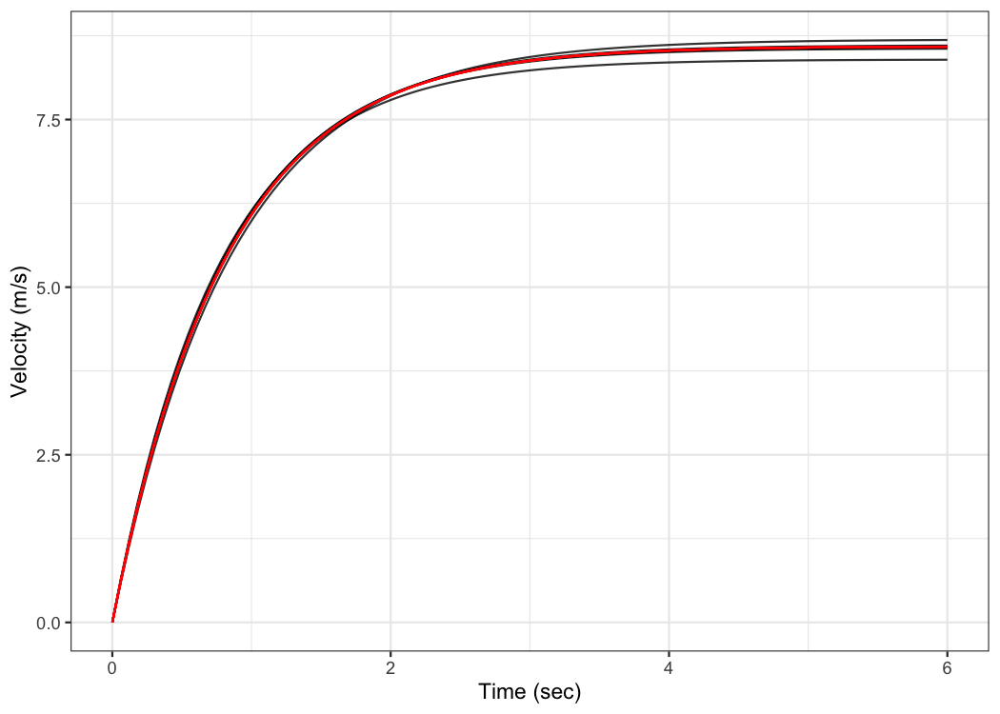
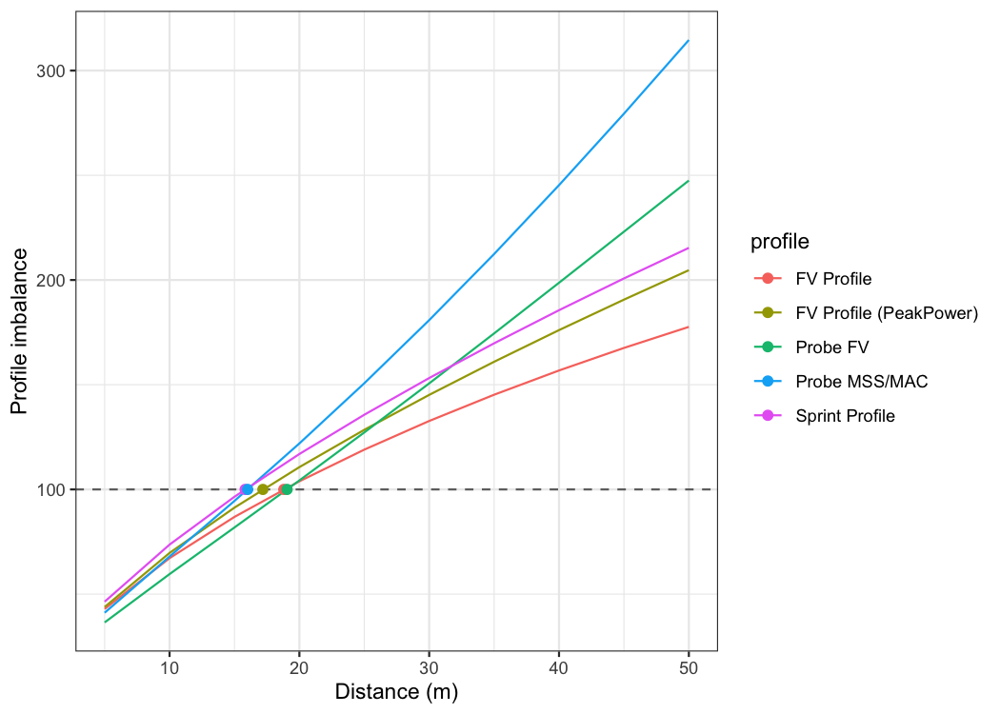

<!-- README.md is generated from README.Rmd. Please edit that file  -->

# shorts 

<!-- badges: start -->

[](https://cran.r-project.org/package=shorts)
[](https://zenodo.org/badge/latestdoi/254907272)
<!-- badges: end -->

This package creates short sprint (\<6sec) profiles using the split
times, or the radar gun data. Mono-exponential equation is used to
estimate maximal sprinting speed (MSS), relative acceleration (TAU), and
other parameters. These parameters can be used to predict kinematic and
kinetics variables and to compare individuals.

## Installation

``` r
# Install from CRAN
install.packages("shorts")

# Or the development version from GitHub
# install.packages("devtools")
devtools::install_github("mladenjovanovic/shorts")
```

## Examples

**{shorts}** comes with two sample data sets: `split_times` and
`radar_gun_data` with N=5 athletes. Let’s load them both:

``` r
require(shorts)
require(tidyverse)
require(knitr)

data("split_times", "radar_gun_data")
```

### Profiling using split times

To model sprint performance using split times, distance will be used as
predictor and time as target. Since `split_times` contains data for
multiple athletes, let’s extract only one athlete and model it using
`shorts::model_timing_gates()` function.

``` r
kimberley_data <- filter(split_times, athlete == "Kimberley")

kable(kimberley_data)
```

| athlete   | bodyweight | distance |  time |
|:----------|-----------:|---------:|------:|
| Kimberley |         55 |        5 | 1.158 |
| Kimberley |         55 |       10 | 1.893 |
| Kimberley |         55 |       15 | 2.541 |
| Kimberley |         55 |       20 | 3.149 |
| Kimberley |         55 |       30 | 4.313 |
| Kimberley |         55 |       40 | 5.444 |

`shorts::model_timing_gates()` returns an object with `parameters`,
`model_fit`, `model` returned from `minpack.lm::nlsLM()` function and
`data` used to estimate parameters. Parameters estimated using
mono-exponential equation are *maximal sprinting speed* (MSS), and
*relative acceleration* (TAU). Additional parameters computed from MSS
and TAU are *maximal acceleration* (MAC) and *maximal relative power*
(PMAX) (which is calculated as MAC\*MSS/4).

``` r
kimberley_profile <- shorts::model_timing_gates(
  distance = kimberley_data$distance,
  time = kimberley_data$time
)

kimberley_profile
#> Estimated model parameters
#> --------------------------
#>        MSS        TAU        MAC       PMAX 
#>  8.5911430  0.8113285 10.5889820 22.7428645 
#> 
#> Model fit estimators
#> --------------------
#>         RSE   R_squared      minErr      maxErr   maxAbsErr        RMSE 
#>  0.03403413  0.99965531 -0.05293456  0.02699162  0.05293456  0.02778875 
#>         MAE        MAPE 
#>  0.02333341  1.19263265

summary(kimberley_profile)
#> 
#> Formula: time ~ TAU * I(LambertW::W(-exp(1)^(-distance/(MSS * TAU) - 1))) + 
#>     distance/MSS + TAU
#> 
#> Parameters:
#>     Estimate Std. Error t value Pr(>|t|)    
#> MSS  8.59114    0.12251   70.13 2.48e-07 ***
#> TAU  0.81133    0.04581   17.71 5.97e-05 ***
#> ---
#> Signif. codes:  0 '***' 0.001 '**' 0.01 '*' 0.05 '.' 0.1 ' ' 1
#> 
#> Residual standard error: 0.03403 on 4 degrees of freedom
#> 
#> Number of iterations to convergence: 5 
#> Achieved convergence tolerance: 1.49e-08

coef(kimberley_profile)
#>        MSS        TAU        MAC       PMAX 
#>  8.5911430  0.8113285 10.5889820 22.7428645
```

To return the predicted outcome (in this case time variable), use
`predict()` function:

``` r
predict(kimberley_profile)
#> [1] 1.210935 1.897021 2.521028 3.122008 4.299243 5.466324
```

To create a simple plot, use S3 `plot()` method:

``` r
plot(kimberley_profile) +
  theme_bw()
```


If you are interested in calculating average split velocity, use
`shorts::format_splits()`

``` r
kable(shorts::format_splits(
  distance = kimberley_data$distance,
  time = kimberley_data$time
))
```

| split | split_distance_start | split_distance_stop | split_distance | split_time_start | split_time_stop | split_time | split_mean_velocity | split_mean_acceleration |
|------:|---------------------:|--------------------:|---------------:|-----------------:|----------------:|-----------:|--------------------:|------------------------:|
|     1 |                    0 |                   5 |              5 |                0 |           1.158 |      1.158 |          4.317789…. |              3.728660…. |
|     2 |                    5 |                  10 |              5 |            1.158 |           1.893 |      0.735 |          6.802721…. |              3.380859…. |
|     3 |                   10 |                  15 |              5 |            1.893 |           2.541 |      0.648 |          7.716049…. |              1.409457…. |
|     4 |                   15 |                  20 |              5 |            2.541 |           3.149 |      0.608 |          8.223684…. |              0.834925…. |
|     5 |                   20 |                  30 |             10 |            3.149 |           4.313 |      1.164 |          8.591065…. |              0.315619…. |
|     6 |                   30 |                  40 |             10 |            4.313 |           5.444 |      1.131 |          8.841732…. |              0.221633…. |

Let’s plot observed vs fitted split times. For this we can use `data`
returned from `shorts::model_timing_gates()` since it contains
`pred_time` column.

``` r
ggplot(kimberley_profile$data, aes(x = distance)) +
  theme_bw() +
  geom_point(aes(y = time)) +
  geom_line(aes(y = pred_time)) +
  xlab("Distance (m)") +
  ylab("Time (s)")
```


To plot predicted velocity, acceleration, air resistance, force, and
power over distance, use `shorts:predict_XXX()`. Please note that to
calculate force, air resistance, and power, we need Kimberley’s bodymass
and height (as well as other characteristics such as air pressure,
temperature and wind - see `get_air_resistance()` function).

``` r
kimberley_bodymass <- 60 # in kilograms
kimberley_bodyheight <- 1.7 # in meters

kimberley_pred <- tibble(
  distance = seq(0, 40, length.out = 1000),

  # Velocity
  pred_velocity = shorts::predict_velocity_at_distance(
    distance,
    kimberley_profile$parameters$MSS,
    kimberley_profile$parameters$TAU
  ),

  # Acceleration
  pred_acceleration = shorts::predict_acceleration_at_distance(
    distance,
    kimberley_profile$parameters$MSS,
    kimberley_profile$parameters$TAU
  ),

  # Air resistance
  pred_air_resistance = shorts::predict_air_resistance_at_distance(
    distance,
    kimberley_profile$parameters$MSS,
    kimberley_profile$parameters$TAU,
    bodymass = kimberley_bodymass,
    bodyheight = kimberley_bodyheight
  ),

  # Force
  pred_force = shorts::predict_force_at_distance(
    distance,
    kimberley_profile$parameters$MSS,
    kimberley_profile$parameters$TAU,
    bodymass = kimberley_bodymass,
    bodyheight = kimberley_bodyheight
  ),

  # Power
  pred_power = shorts::predict_power_at_distance(
    distance,
    kimberley_profile$parameters$MSS,
    kimberley_profile$parameters$TAU,
    bodymass = kimberley_bodymass,
    bodyheight = kimberley_bodyheight
  ),
)

# Convert to long
kimberley_pred <- gather(kimberley_pred, "metric", "value", -distance)

ggplot(kimberley_pred, aes(x = distance, y = value)) +
  theme_bw() +
  geom_line() +
  facet_wrap(~metric, scales = "free_y") +
  xlab("Distance (m)") +
  ylab(NULL)
```


To do prediction simpler, use `shorts::predict_kinematics()` function.
This will provide kinetics and kinematics for 0-6s sprint using 100Hz.

``` r
predicted_kinematics <- predict_kinematics(
  kimberley_profile,
  bodymass = kimberley_bodymass,
  bodyheight = kimberley_bodyheight
)

kable(head(predicted_kinematics))
```

| time |  distance |  velocity | acceleration | bodymass | inertia | resistance | net_horizontal_force | air_resistance | horizontal_force | horizontal_force_relative | vertical_force | resultant_force | resultant_force_relative |     power | relative_power |        RF | force_angle |
|-----:|----------:|----------:|-------------:|---------:|--------:|-----------:|---------------------:|---------------:|-----------------:|--------------------------:|---------------:|----------------:|-------------------------:|----------:|---------------:|----------:|------------:|
| 0.00 | 0.0000000 | 0.0000000 |    10.588982 |       60 |       0 |          0 |             635.3389 |      0.0000000 |         635.3389 |                 10.588982 |          588.6 |        866.0863 |                 14.43477 |   0.00000 |       0.000000 | 0.7335746 |    42.81309 |
| 0.01 | 0.0005273 | 0.1052399 |    10.459269 |       60 |       0 |          0 |             627.5561 |      0.0026620 |         627.5588 |                 10.459313 |          588.6 |        860.3953 |                 14.33992 |  66.04424 |       1.100737 | 0.7293843 |    43.16520 |
| 0.02 | 0.0021005 | 0.2091907 |    10.331145 |       60 |       0 |          0 |             619.8687 |      0.0105181 |         619.8792 |                 10.331320 |          588.6 |        854.8100 |                 14.24683 | 129.67295 |       2.161216 | 0.7251660 |    43.51734 |
| 0.03 | 0.0047068 | 0.3118680 |    10.204590 |       60 |       0 |          0 |             612.2754 |      0.0233774 |         612.2988 |                 10.204980 |          588.6 |        849.3290 |                 14.15548 | 190.95643 |       3.182607 | 0.7209206 |    43.86946 |
| 0.04 | 0.0083337 | 0.4132876 |    10.079586 |       60 |       0 |          0 |             604.7751 |      0.0410543 |         604.8162 |                 10.080270 |          588.6 |        843.9506 |                 14.06584 | 249.96306 |       4.166051 | 0.7166488 |    44.22151 |
| 0.05 | 0.0129685 | 0.5134649 |     9.956113 |       60 |       0 |          0 |             597.3668 |      0.0633688 |         597.4301 |                  9.957169 |          588.6 |        838.6732 |                 13.97789 | 306.75938 |       5.112656 | 0.7123515 |    44.57343 |

To get model residuals, use `residuals()` function:

``` r
residuals(kimberley_profile)
#> [1] -0.052934560 -0.004021206  0.019971712  0.026991617  0.013756878
#> [6] -0.022324483
```

Package **{shorts}** comes with `find_XXX()` family of functions that
allow finding peak power and it’s location, as well as *critical
distance* over which velocity, acceleration, or power drops below
certain threshold:

``` r
# Peak power and location
shorts::find_peak_power_distance(
  MSS = kimberley_profile$parameters$MSS,
  MAC = kimberley_profile$parameters$MAC, 
  bodymass = kimberley_bodymass,
  bodyheight = kimberley_bodyheight
)
#> $peak_power
#> [1] 1384.248
#> 
#> $distance
#> [1] 1.424183

# Distance over which power is over 80%
shorts::find_power_critical_distance(
  MSS = kimberley_profile$parameters$MSS,
  MAC = kimberley_profile$parameters$MAC, 
  bodymass = kimberley_bodymass,
  bodyheight = kimberley_bodyheight,
  percent = 0.8
)
#> $lower
#> [1] 0.3421958
#> 
#> $upper
#> [1] 4.26947

# Distance over which acceleration is under 50%
shorts::find_acceleration_critical_distance(
  MSS = kimberley_profile$parameters$MSS,
  MAC = kimberley_profile$parameters$MAC,
  percent = 0.5
)
#> [1] 1.34628

# Distance over which velocity is over 95%
shorts::find_velocity_critical_distance(
  MSS = kimberley_profile$parameters$MSS,
  MAC = kimberley_profile$parameters$MAC,
  percent = 0.95
)
#> [1] 14.25923
```

### Profiling using radar gun data

The radar gun data is modeled using measured velocity as target variable
and time as predictor. Individual analysis is performed using
`shorts::model_radar_gun()` function. Let’s do analysis for Jim:

``` r
jim_data <- filter(radar_gun_data, athlete == "Jim")

jim_profile <- shorts::model_radar_gun(
  time = jim_data$time,
  velocity = jim_data$velocity
)

jim_profile
#> Estimated model parameters
#> --------------------------
#>          MSS          TAU          MAC         PMAX           TC 
#> 7.998011e+00 8.887955e-01 8.998708e+00 1.799294e+01 1.103989e-04 
#> 
#> Model fit estimators
#> --------------------
#>         RSE   R_squared      minErr      maxErr   maxAbsErr        RMSE 
#>  0.05062927  0.99924409 -0.16404520  0.15112314  0.16404520  0.05050254 
#>         MAE        MAPE 
#>  0.03927236         Inf

summary(jim_profile)
#> 
#> Formula: velocity ~ MSS * (1 - exp(1)^(-(time + TC)/TAU))
#> 
#> Parameters:
#>      Estimate Std. Error t value Pr(>|t|)    
#> MSS 7.9980114  0.0031934 2504.54   <2e-16 ***
#> TAU 0.8887955  0.0021794  407.81   <2e-16 ***
#> TC  0.0001104  0.0012283    0.09    0.928    
#> ---
#> Signif. codes:  0 '***' 0.001 '**' 0.01 '*' 0.05 '.' 0.1 ' ' 1
#> 
#> Residual standard error: 0.05063 on 597 degrees of freedom
#> 
#> Number of iterations to convergence: 6 
#> Achieved convergence tolerance: 1.49e-08

plot(jim_profile) +
  theme_bw()
```


The object returned from `shorts::model_radar_gun()` is same as object
returned from `shorts::model_timing_gates()`. Let’s plot Jim’s measured
velocity and predicted velocity:

``` r
ggplot(jim_profile$data, aes(x = time)) +
  theme_bw() +
  geom_line(aes(y = velocity), alpha = 0.5) +
  geom_line(aes(y = pred_velocity), color = "red", alpha = 0.5) +
  xlab("Time (s)") +
  ylab("Velocity (m/s)")
```


Rather than estimating MSS, `shorts::model_radar_gun()` function allows
you to utilize peak velocity observed in the data as MSS. This is done
by setting the `use_observed_MSS` parameter to `TRUE`:

``` r
jim_profile <- shorts::model_radar_gun(
  time = jim_data$time,
  velocity = jim_data$velocity,
  use_observed_MSS = TRUE
)

jim_profile
#> Estimated model parameters
#> --------------------------
#>         MSS         TAU         MAC        PMAX          TC 
#>  8.09500000  0.93279456  8.67822382 17.56255546  0.01117667 
#> 
#> Model fit estimators
#> --------------------
#>         RSE   R_squared      minErr      maxErr   maxAbsErr        RMSE 
#>  0.08004636  0.99875693 -0.22869210  0.18253899  0.22869210  0.07984600 
#>         MAE        MAPE 
#>  0.06431869         Inf

summary(jim_profile)
#> 
#> Formula: velocity ~ MSS * (1 - exp(1)^(-(time + TC)/TAU))
#> 
#> Parameters:
#>     Estimate Std. Error  t value Pr(>|t|)    
#> MSS 8.095000   0.005209 1554.099  < 2e-16 ***
#> TAU 0.932795   0.003605  258.739  < 2e-16 ***
#> TC  0.011177   0.002025    5.519  5.1e-08 ***
#> ---
#> Signif. codes:  0 '***' 0.001 '**' 0.01 '*' 0.05 '.' 0.1 ' ' 1
#> 
#> Residual standard error: 0.08005 on 597 degrees of freedom
#> 
#> Number of iterations to convergence: 5 
#> Achieved convergence tolerance: 1.49e-08
```

### Profiling using tether devices

Some tether devices provide data out in a velocity-at-distance format.
In this case, velocity is the outcome variable and distance is the
predictor. To estimate sprint profiles from *tether data*, use
`shorts::model_tether()` function:

``` r
distance <- c(5, 10, 20, 30, 40)

velocity <- predict_velocity_at_distance(distance, MSS = 10, MAC = 8)

m1 <- model_tether(distance = distance, velocity = velocity)

df <- data.frame(
  distance = distance,
  obs_velocity = velocity
)

plot(m1) +
  geom_point(data = df, aes(x = distance, y = obs_velocity))
```


Setting `use_observed_MSS` parameter to `TRUE` in the
`shorts::model_tether()` function also allows you to use observed peak
velocity as MSS.

In the case when distance is not centered at zero, use
`shorts::model_tether_DC()` which also estimated the *distance
correction* (DC) parameter, serving as model intercept:

``` r
distance <- c(5, 10, 20, 30, 40)

velocity <- predict_velocity_at_distance(distance - 0.5, MSS = 10, MAC = 8)

m1 <- model_tether_DC(distance = distance, velocity = velocity)
m1
#> Estimated model parameters
#> --------------------------
#>   MSS   TAU   MAC  PMAX    DC 
#> 10.00  1.25  8.00 20.00 -0.50 
#> 
#> Model fit estimators
#> --------------------
#>          RSE    R_squared       minErr       maxErr    maxAbsErr         RMSE 
#> 1.538370e-15 1.000000e+00 0.000000e+00 1.776357e-15 1.776357e-15 9.729507e-16 
#>          MAE         MAPE 
#> 7.105427e-16 8.773026e-15
```

### Force-Velocity Profiling

To estimate *Force-Velocity Profile* (FVP) using approach by Samozino
*et al.* (2016, 2022) use `shorts::make_FV_profile()`:

``` r
kimberley_fv <- shorts::make_FV_profile(
  MSS = kimberley_profile$parameters$MSS,
  MAC = kimberley_profile$parameters$MAC,
  # These are needed to estimate air resistance
  bodymass = kimberley_bodymass,
  bodyheight = kimberley_bodyheight
)

kimberley_fv
#> $bodymass
#> [1] 60
#> 
#> $F0
#> [1] 635.3389
#> 
#> $F0_rel
#> [1] 10.58898
#> 
#> $V0
#> [1] 8.845438
#> 
#> $Pmax
#> [1] 1404.963
#> 
#> $Pmax_rel
#> [1] 23.41605
#> 
#> $FV_slope
#> [1] -1.197112
```

To convert back to *Acceleration-Velocity Profile* (AVP), use:

``` r
kimberley_avp <- shorts::convert_FV(
  F0 = kimberley_fv$F0,
  V0 = kimberley_fv$V0,
  bodymass = kimberley_bodymass,
  bodyheight = kimberley_bodyheight
)

kimberley_avp
#> $MSS
#> [1] 8.591143
#> 
#> $MAC
#> [1] 10.58898
```

### Using external load

**{shorts}** package also allows utilizing external load in estimating
FVP, as well as using FVP parameters to predict kinematic and kinetic
variables. External load is represented either with additional
**inertia** (i.e., weight vest), horizontal **resistance** (i.e., tether
device that create additional resistance or help, or a hill sprinting),
or both (i.e., a sled, which have both inertia and resistance due to
friction forces).

Let’s see how theoretical model, assuming FVP is *determinant of
performance* (which I do not agree with, BTW), predicts changes in
sprint characteristics (i.e., MSS and MAC) under different external load
conditions and magnitudes using Kimberley’s estimated FVP:

``` r
loads_df <- rbind(
  tibble(type = "Weight vest", magnitude = seq(0, 20, length.out = 100), inertia = magnitude, resistance = 0),
  tibble(type = "Tether", magnitude = seq(-50, 200, length.out = 100), inertia = 0, resistance = magnitude),
  tibble(type = "Sled", magnitude = seq(0, 40, length.out = 100), inertia = magnitude, resistance = magnitude * 9.81 * 0.4)
) %>%
  mutate(
    data.frame(shorts::convert_FV(
      F0 = kimberley_fv$F0,
      V0 = kimberley_fv$V0,
      bodymass = kimberley_bodymass,
      bodyheight = kimberley_bodyheight,
      inertia = inertia,
      resistance = resistance
    ))
  ) 

loads_df %>%
  pivot_longer(cols = c(MSS, MAC), names_to = "parameter") %>%
  ggplot(aes(x = magnitude, y = value, color = parameter)) +
  theme_bw() + 
  geom_vline(xintercept = 0, linetype = "dotted") +
  geom_line() +
  facet_wrap(~type, scales = "free_x") +
  ylab(NULL)
```


Following figure depicts the effect on split times under different load
types and magnitudes, assuming FVP to be determinant of performance
(i.e., causal mechanism):

``` r
dist_df <- expand_grid(
  loads_df,
  distance = c(5, 10, 20, 30, 40)
) %>%
  mutate(
    time = predict_time_at_distance(distance, MSS, MAC),
    distance = factor(
      paste0(distance, "m"), levels = c("5m", "10m", "20m", "30m", "40m"))
  ) 

dist_df %>%
  ggplot(aes(x = magnitude, y = time, color = distance)) +
  theme_bw() + 
  geom_vline(xintercept = 0, linetype = "dotted") +
  geom_line() +
  facet_wrap(~type, scales = "free_x") +
  ylab("Time (s)")
```


One can use external resistance when predicting force or power:

``` r
shorts::predict_force_at_time(
  time = 0.5,
  MSS = 9,
  MAC = 7,
  bodymass = 75,
  inertia = 20,
  resistance = 50)
#> [1] 503.0126

shorts::predict_power_at_time(
  time = 0.5,
  MSS = 9,
  MAC = 7,
  bodymass = 75,
  inertia = 20,
  resistance = 50)
#> [1] 1458.593

shorts::predict_time_at_distance_FV(
  distance = 10,
  F0 = 750,
  V0 = 8,
  bodymass = 75,
  inertia = 20,
  resistance = 50)
#> [1] 2.259444
```

External resistances can also be utilized in the
[Optimization](#optimization) functions, covered later.

### Using corrections

You have probably noticed that estimated MSS and TAU were a bit too high
for splits data. Biased estimates are due to differences in starting
positions and *timing triggering methods* for certain measurement
approaches (e.g. starting behind first timing gate, or allowing for body
rocking).

Here I will provide quick summary. Often, this bias in estimates is
dealt with by using heuristic rule of thumb of adding time correction
(`time_correction`) to split times (e.g. from 0.3-0.5sec; see more in
Haugen *et al.*, 2012). To do this, just add time correction to time
split:

``` r
kimberley_profile_fixed_TC <- shorts::model_timing_gates(
  distance = kimberley_data$distance,
  time = kimberley_data$time + 0.3
)

kimberley_profile_fixed_TC
#> Estimated model parameters
#> --------------------------
#>       MSS       TAU       MAC      PMAX 
#>  9.127769  1.377624  6.625731 15.119536 
#> 
#> Model fit estimators
#> --------------------
#>          RSE    R_squared       minErr       maxErr    maxAbsErr         RMSE 
#>  0.009969260  0.999971375 -0.007689947  0.016398636  0.016398636  0.008139867 
#>          MAE         MAPE 
#>  0.006393853  0.285701748

summary(kimberley_profile_fixed_TC)
#> 
#> Formula: time ~ TAU * I(LambertW::W(-exp(1)^(-distance/(MSS * TAU) - 1))) + 
#>     distance/MSS + TAU
#> 
#> Parameters:
#>     Estimate Std. Error t value Pr(>|t|)    
#> MSS  9.12777    0.05355  170.44 7.11e-09 ***
#> TAU  1.37762    0.02131   64.66 3.43e-07 ***
#> ---
#> Signif. codes:  0 '***' 0.001 '**' 0.01 '*' 0.05 '.' 0.1 ' ' 1
#> 
#> Residual standard error: 0.009969 on 4 degrees of freedom
#> 
#> Number of iterations to convergence: 5 
#> Achieved convergence tolerance: 1.49e-08

coef(kimberley_profile_fixed_TC)
#>       MSS       TAU       MAC      PMAX 
#>  9.127769  1.377624  6.625731 15.119536
```

Instead of providing for `TC`, this parameter can be estimated using
`shorts::model_timing_gates_TC()`.

``` r
kimberley_profile_TC <- shorts::model_timing_gates_TC(
  distance = kimberley_data$distance,
  time = kimberley_data$time
)

kimberley_profile_TC
#> Estimated model parameters
#> --------------------------
#>        MSS        TAU        MAC       PMAX         TC 
#>  8.9748354  1.2348566  7.2679173 16.3070903  0.2346537 
#> 
#> Model fit estimators
#> --------------------
#>           RSE     R_squared        minErr        maxErr     maxAbsErr 
#>  0.0011290466  0.9999996942 -0.0011807345  0.0012094658  0.0012094658 
#>          RMSE           MAE          MAPE 
#>  0.0007983565  0.0006586034  0.0282353187
```

Instead of estimating `TC`, **{shorts}** package features a method of
estimating flying start distance (`FD`):

``` r
kimberley_profile_FD <- shorts::model_timing_gates_FD(
  distance = kimberley_data$distance,
  time = kimberley_data$time
)

kimberley_profile_FD
#> Estimated model parameters
#> --------------------------
#>        MSS        TAU        MAC       PMAX         FD 
#>  9.0026808  1.2877008  6.9912831 15.7350726  0.3015635 
#> 
#> Model fit estimators
#> --------------------
#>           RSE     R_squared        minErr        maxErr     maxAbsErr 
#>  0.0003901336  0.9999999635 -0.0004036159  0.0004557031  0.0004557031 
#>          RMSE           MAE          MAPE 
#>  0.0002758661  0.0002367539  0.0078291094
```

If you want to use fixed `FD` parameter (e.g., when you know what is the
flying distance), in a similar vein of using fixed `TC` correction, use:

``` r
kimberley_profile_fixed_FD <- shorts::model_timing_gates_FD(
  distance = kimberley_data$distance,
  time = kimberley_data$time,
  FD = 0.5
)

kimberley_profile_fixed_FD
#> Estimated model parameters
#> --------------------------
#>       MSS       TAU       MAC      PMAX        FD 
#>  9.178464  1.472935  6.231413 14.298700  0.500000 
#> 
#> Model fit estimators
#> --------------------
#>          RSE    R_squared       minErr       maxErr    maxAbsErr         RMSE 
#>  0.011228028  0.999973897 -0.007903690  0.015461987  0.015461987  0.007939415 
#>          MAE         MAPE 
#>  0.006718969  0.349905006
```

### Cross-Validation (CV)

`model_timing_gates_()` family of functions come with LOOCV feature that
is performed by setting the function parameter `LOOCV = TRUE`. This
feature is very useful for checking model parameters robustness and
model predictions on unseen data. LOOCV involve iterative model building
and testing by removing observation one by one and making predictions
for them. Let’s use Kimberley again, but this time perform LOOCV:

``` r
kimberley_profile_LOOCV <- shorts::model_timing_gates(
  distance = kimberley_data$distance,
  time = kimberley_data$time,
  LOOCV = TRUE
)

kimberley_profile_LOOCV
#> Estimated model parameters
#> --------------------------
#>        MSS        TAU        MAC       PMAX 
#>  8.5911430  0.8113285 10.5889820 22.7428645 
#> 
#> Model fit estimators
#> --------------------
#>         RSE   R_squared      minErr      maxErr   maxAbsErr        RMSE 
#>  0.03403413  0.99965531 -0.05293456  0.02699162  0.05293456  0.02778875 
#>         MAE        MAPE 
#>  0.02333341  1.19263265 
#> 
#> 
#> Cross-Validation
#> ------------------------------
#> Parameters:
#> # A tibble: 6 × 4
#>     MSS   TAU   MAC  PMAX
#>   <dbl> <dbl> <dbl> <dbl>
#> 1  8.69 0.856  10.2  22.1
#> 2  8.60 0.815  10.5  22.7
#> 3  8.56 0.795  10.8  23.0
#> 4  8.57 0.797  10.8  23.0
#> 5  8.61 0.813  10.6  22.8
#> 6  8.39 0.760  11.1  23.2
#> 
#> Testing model fit:
#>         RSE   R_squared      minErr      maxErr   maxAbsErr        RMSE 
#>          NA  0.99901083 -0.08009035  0.03444978  0.08009035  0.04742764 
#>         MAE        MAPE 
#>  0.03923868  1.72270378
```

Box-plot is suitable method for plotting estimated parameters:

``` r
LOOCV_parameters <- gather(kimberley_profile_LOOCV$CV$parameters)

ggplot(LOOCV_parameters, aes(y = value)) +
  theme_bw() +
  geom_boxplot() +
  facet_wrap(~key, scales = "free") +
  ylab(NULL) +
  theme(axis.ticks.x = element_blank(), axis.text.x = element_blank())
```


Let’s plot model LOOCV predictions and training (when using all data
set) predictions against observed performance:

``` r
kimberley_data <- kimberley_data %>%
  mutate(
    pred_time = predict(kimberley_profile_LOOCV),
    LOOCV_time = kimberley_profile_LOOCV$CV$data$pred_time
  )

ggplot(kimberley_data, aes(x = distance)) +
  theme_bw() +
  geom_point(aes(y = time)) +
  geom_line(aes(y = pred_time), color = "black") +
  geom_line(aes(y = LOOCV_time), color = "red") +
  xlab("Distance (m)") +
  ylab("Time (s)")
```


Let’s plot predicted velocity using LOOCV estimate parameters to check
robustness of the model predictions:

``` r
plot_data <- kimberley_profile_LOOCV$CV$parameters %>%
  mutate(LOOCV = row_number())

plot_data <- expand_grid(
  data.frame(time = seq(0, 6, length.out = 100)),
  plot_data
) %>%
  mutate(
    LOOCV_velocity = predict_velocity_at_time(
      time = time,
      MSS = MSS,
      MAC = MAC
    ),
    velocity = predict_velocity_at_time(
      time = time,
      MSS = kimberley_profile_LOOCV$parameters$MSS,
      MAC = kimberley_profile_LOOCV$parameters$MAC
    )
  )

ggplot(plot_data, aes(x = time, y = LOOCV_velocity, group = LOOCV)) +
  theme_bw() +
  geom_line(alpha = 0.8) +
  geom_line(aes(y = velocity), color = "red", size = 0.5) +
  xlab("Time (sec)") +
  ylab("Velocity (m/s)")
```



Cross-validation implemented in `model_radar_gun()` function involves
using n-folds, set by using `CV=` parameter:

``` r
jim_profile_CV <- shorts::model_radar_gun(
  time = jim_data$time,
  velocity = jim_data$velocity,
  CV = 10
)

jim_profile_CV
#> Estimated model parameters
#> --------------------------
#>          MSS          TAU          MAC         PMAX           TC 
#> 7.998011e+00 8.887955e-01 8.998708e+00 1.799294e+01 1.103989e-04 
#> 
#> Model fit estimators
#> --------------------
#>         RSE   R_squared      minErr      maxErr   maxAbsErr        RMSE 
#>  0.05062927  0.99924409 -0.16404520  0.15112314  0.16404520  0.05050254 
#>         MAE        MAPE 
#>  0.03927236         Inf 
#> 
#> 
#> Cross-Validation
#> ------------------------------
#> Parameters:
#> # A tibble: 10 × 5
#>      MSS   TAU   MAC  PMAX         TC
#>    <dbl> <dbl> <dbl> <dbl>      <dbl>
#>  1  8.00 0.888  9.00  18.0  0.0000839
#>  2  8.00 0.889  8.99  18.0  0.000457 
#>  3  8.00 0.889  9.00  18.0 -0.000151 
#>  4  8.00 0.889  9.00  18.0 -0.0000337
#>  5  8.00 0.888  9.00  18.0  0.000124 
#>  6  8.00 0.889  9.00  18.0  0.000107 
#>  7  8.00 0.888  9.01  18.0 -0.0000673
#>  8  8.00 0.889  9.00  18.0  0.0000695
#>  9  8.00 0.889  8.99  18.0  0.000263 
#> 10  8.00 0.889  9.00  18.0  0.000259 
#> 
#> Testing model fit:
#>         RSE   R_squared      minErr      maxErr   maxAbsErr        RMSE 
#>          NA  0.99923997 -0.16426599  0.15245264  0.16426599  0.05063981 
#>         MAE        MAPE 
#>  0.03940131         Inf
```

### Optimization

Using the method outlined in Samozino *et al* (2022), one can find the
optimal profiles, as well as the profile imbalance (compared to the
optimal), for both sprint profiles (i.e., MSS and MAC) and
Force-Velocity (FV). In addition to this, one can *probe* the profiles
(i.e., increase V0/F0 or MSS/MAC for say 2.5% to check which improvement
yield more improvement in sprint time). The following graph depicts
estimate profile imbalances. Note that \>100% is velocity deficit (i.e.,
increasing *velocity*; MSS or V0; will yield more improvement in sprint
times), while \<100% is *force* deficit.

``` r
MSS <- 10
MAC <- 8
bodymass <- 75

fv <- make_FV_profile(MSS, MAC, bodymass)

opt_df <- tibble(
  dist = seq(5, 50, by = 5)
) %>%
  mutate(
    `Sprint Profile` = optimal_MSS_MAC(
      distance = dist,
      MSS,
      MAC
    )[["profile_imb"]],
    `FV Profile` = optimal_FV(
      distance = dist,
      fv$F0,
      fv$V0,
      bodymass
    )[["profile_imb"]],
    `FV Profile (PeakPower)` = optimal_FV(
      distance = dist,
      fv$F0,
      fv$V0,
      bodymass,
      method = "peak"
    )[["profile_imb"]],
    `Probe FV` = probe_FV(
      distance = dist,
      fv$F0,
      fv$V0,
      bodymass
    )[["profile_imb"]],
    `Probe MSS/MAC` = probe_MSS_MAC(
      distance = dist,
      MSS,
      MAC
    )[["profile_imb"]]
  ) %>%
  pivot_longer(-dist, names_to = "profile")

opt_dist <- tibble(
  `Sprint Profile` = find_optimal_distance(
    MSS,
    MAC,
    optimal_func = optimal_MSS_MAC
  ),
  `FV Profile` = find_optimal_distance(
    fv$F0,
    fv$V0,
    bodymass,
    optimal_func = optimal_FV
  ),
  `FV Profile (PeakPower)` = find_optimal_distance(
    fv$F0,
    fv$V0,
    bodymass,
    optimal_func = optimal_FV,
    method = "peak"
  ),
  `Probe FV` = find_optimal_distance(
    fv$F0,
    fv$V0,
    bodymass,
    optimal_func = probe_FV
  ),
  `Probe MSS/MAC` = find_optimal_distance(
    MSS,
    MAC,
    optimal_func = probe_MSS_MAC
  )
) %>%
  pivot_longer(cols = 1:5, names_to = "profile")

ggplot(opt_df, aes(x = dist, y = value, color = profile)) +
  theme_bw() +
  geom_hline(yintercept = 100, linetype = "dashed", alpha = 0.6) +
  geom_line() +
  geom_point(data = opt_dist, aes(x = value, y = 100), size = 2) +
  xlab("Distance (m)") +
  ylab("Profile imbalance")
```



## Publications

1.  Jovanović, M., Vescovi, J.D. (2022). **{shorts}: An R Package for
    Modeling Short Sprints**. *International Journal of Strength and
    Conditioning, 2(1).* <https://doi.org/10.47206/ijsc.v2i1.74>

2.  Jovanović M. (2023). **Bias in estimated short sprint profiles using
    timing gates due to the flying start: simulation study and proposed
    solutions.** *Computer Methods in Biomechanics and Biomedical
    Engineering:1–11*. <https://doi.org/10.1080/10255842.2023.2170713>

3.  Vescovi, JD and Jovanović, M. (2021). **Sprint Mechanical
    Characteristics of Female Soccer Players: A Retrospective Pilot
    Study to Examine a Novel Approach for Correction of Timing Gate
    Starts.** *Front Sports Act Living 3: 629694, 2021.*
    <https://doi.org/10.3389/fspor.2021.629694>

## Citation

To cite **{shorts}**, please use the following command to get the BibTex
entry:

``` r
citation("shorts")
```

## References

Please refer to these publications for more information on short sprints
modeling using mono-exponential equation:

Chelly SM, Denis C. 2001. Leg power and hopping stiffness: relationship
with sprint running performance: Medicine and Science in Sports and
Exercise:326–333. DOI: 10.1097/00005768-200102000-00024.

Clark KP, Rieger RH, Bruno RF, Stearne DJ. 2017. The NFL Combine 40-Yard
Dash: How Important is Maximum Velocity? Journal of Strength and
Conditioning Research:1. DOI: 10.1519/JSC.0000000000002081.

Furusawa K, Hill AV, and Parkinson JL. The dynamics of” sprint” running.
Proceedings of the Royal Society of London. Series B, Containing Papers
of a Biological Character 102 (713): 29-42, 1927

Greene PR. 1986. Predicting sprint dynamics from maximum-velocity
measurements. Mathematical Biosciences 80:1–18. DOI:
10.1016/0025-5564(86)90063-5.

Haugen TA, Tønnessen E, Seiler SK. 2012. The Difference Is in the Start:
Impact of Timing and Start Procedure on Sprint Running Performance:
Journal of Strength and Conditioning Research 26:473–479. DOI:
10.1519/JSC.0b013e318226030b.

Samozino P, Rabita G, Dorel S, Slawinski J, Peyrot N, Saez de Villarreal
E, Morin J-B. 2016. A simple method for measuring power, force, velocity
properties, and mechanical effectiveness in sprint running: Simple
method to compute sprint mechanics. Scandinavian Journal of Medicine &
Science in Sports 26:648–658. DOI: 10.1111/sms.12490.

Samozino P. 2018. A Simple Method for Measuring Force, Velocity and
Power Capabilities and Mechanical Effectiveness During Sprint Running.
In: Morin J-B, Samozino P eds. Biomechanics of Training and Testing.
Cham: Springer International Publishing, 237–267. DOI:
10.1007/978-3-319-05633-3_11.

Samozino P, Peyrot N, Edouard P, Nagahara R, Jimenez‐Reyes P,
Vanwanseele B, Morin J. 2022. Optimal mechanical force‐velocity profile
for sprint acceleration performance.Scandinavian Journal of Medicine &
Science in Sports 32:559–575. DOI: 10.1111/sms.14097.
